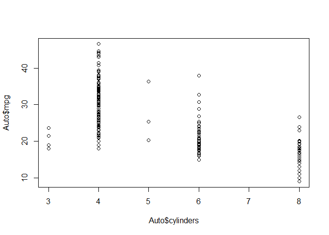
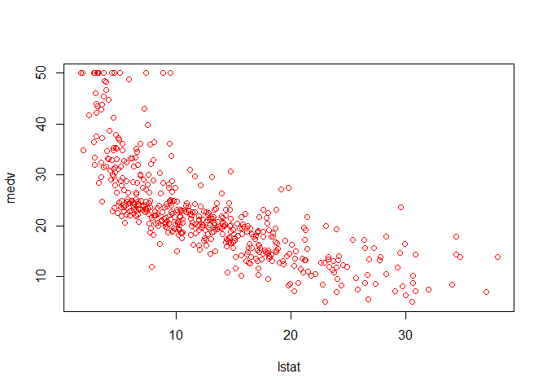
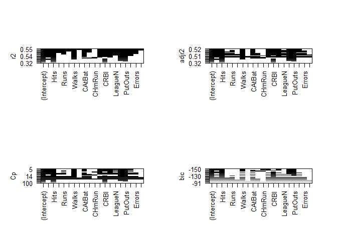
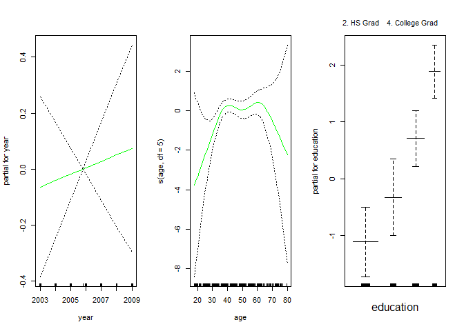
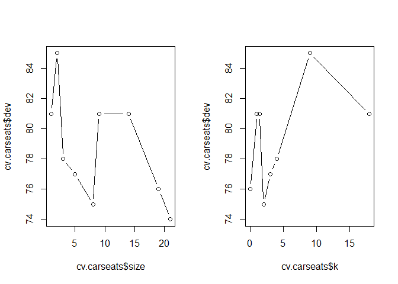
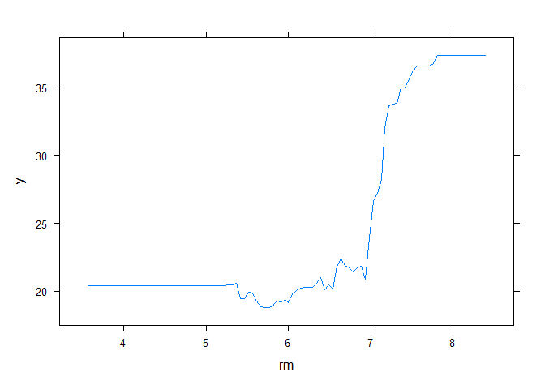
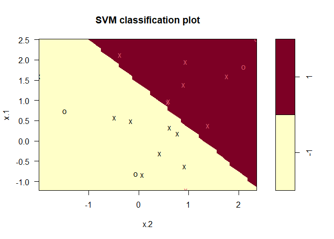
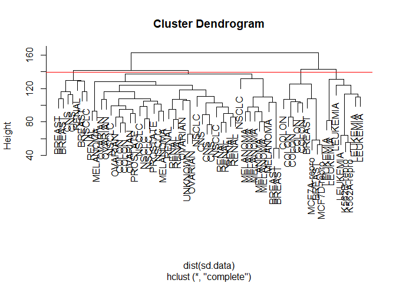
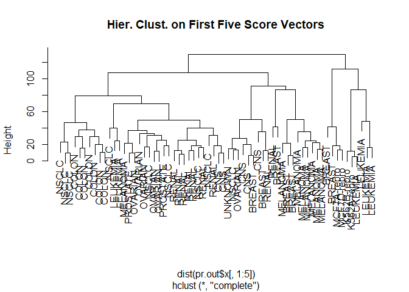

An Intro to Stat Learning Lab
================
Nazmul Hossain

# Chapter 2 Lab: Introduction to R

#### Basic Commands

``` r
# create vector
x <- c(1,3,2,5)
x
```

    [1] 1 3 2 5

``` r
x = c(1,6,2)
x
```

    [1] 1 6 2

``` r
y = c(1,4,3)
#check length
length(x)
```

    [1] 3

``` r
length(y)
```

    [1] 3

``` r
# add two vector
x+y
```

    [1]  2 10  5

``` r
ls() # look a list of all objects
```

    [1] "x" "y"

``` r
rm(x,y) # remove/delete object
ls()
```

    character(0)

``` r
rm(list=ls()) # remove all objects
# create matrix
x=matrix(data=c(1,2,3,4), nrow=2, ncol=2)
x
```

         [,1] [,2]
    [1,]    1    3
    [2,]    2    4

``` r
x=matrix(c(1,2,3,4),2,2)
matrix(c(1,2,3,4),2,2,byrow=TRUE)
```

         [,1] [,2]
    [1,]    1    2
    [2,]    3    4

``` r
sqrt(x)
```

             [,1]     [,2]
    [1,] 1.000000 1.732051
    [2,] 1.414214 2.000000

``` r
x^2
```

         [,1] [,2]
    [1,]    1    9
    [2,]    4   16

``` r
# generate a vector of random variables 
x=rnorm(50) # standard normal with mean 0, standard deviation 1
y=x+rnorm(50,mean=50,sd=.1)
# compute correlation between x & y
cor(x,y)
```

    [1] 0.9962846

``` r
set.seed(1303) # reproduce the exact same set of random numbers
rnorm(50)
```

     [1] -1.1439763145  1.3421293656  2.1853904757  0.5363925179  0.0631929665
     [6]  0.5022344825 -0.0004167247  0.5658198405 -0.5725226890 -1.1102250073
    [11] -0.0486871234 -0.6956562176  0.8289174803  0.2066528551 -0.2356745091
    [16] -0.5563104914 -0.3647543571  0.8623550343 -0.6307715354  0.3136021252
    [21] -0.9314953177  0.8238676185  0.5233707021  0.7069214120  0.4202043256
    [26] -0.2690521547 -1.5103172999 -0.6902124766 -0.1434719524 -1.0135274099
    [31]  1.5732737361  0.0127465055  0.8726470499  0.4220661905 -0.0188157917
    [36]  2.6157489689 -0.6931401748 -0.2663217810 -0.7206364412  1.3677342065
    [41]  0.2640073322  0.6321868074 -1.3306509858  0.0268888182  1.0406363208
    [46]  1.3120237985 -0.0300020767 -0.2500257125  0.0234144857  1.6598706557

``` r
set.seed(3)
y=rnorm(100)
# calculate mean, var, & std
mean(y)
```

    [1] 0.01103557

``` r
var(y)
```

    [1] 0.7328675

``` r
sqrt(var(y))
```

    [1] 0.8560768

``` r
sd(y)
```

    [1] 0.8560768

#### Graphics

``` r
x=rnorm(100)
y=rnorm(100)
# scatter plot
plot(x,y)
```


``` r
plot(x,y,xlab="this is the x-axis",ylab="this is the y-axis",main="Plot of X vs Y")
```


``` r
pdf("Figure.pdf") # save the plot as pdf
plot(x,y,col="green")
dev.off() # indicated done creating plot
```

    png 
      2 

``` r
# sequence of numbers
x=seq(1,10)
x
```

     [1]  1  2  3  4  5  6  7  8  9 10

``` r
x=1:10
x
```

     [1]  1  2  3  4  5  6  7  8  9 10

``` r
x=seq(-pi,pi,length=50)
y=x
f=outer(x,y,function(x,y)cos(y)/(1+x^2))
# countour plot for three dim data
contour(x,y,f)
contour(x,y,f,nlevels=45,add=T)
```


``` r
fa=(f-t(f))/2
contour(x,y,fa,nlevels=15)
```


``` r
image(x,y,fa) # colors coded plot (heatmap)
```


``` r
persp(x,y,fa) 
```


``` r
persp(x,y,fa,theta=30)
```


``` r
persp(x,y,fa,theta=30,phi=20)
```


``` r
persp(x,y,fa,theta=30,phi=70)
```


``` r
persp(x,y,fa,theta=30,phi=40)
```


#### Indexing Data

``` r
A=matrix(1:16,4,4)
A
```

         [,1] [,2] [,3] [,4]
    [1,]    1    5    9   13
    [2,]    2    6   10   14
    [3,]    3    7   11   15
    [4,]    4    8   12   16

``` r
A[2,3]
```

    [1] 10

``` r
A[c(1,3),c(2,4)]
```

         [,1] [,2]
    [1,]    5   13
    [2,]    7   15

``` r
A[1:3,2:4]
```

         [,1] [,2] [,3]
    [1,]    5    9   13
    [2,]    6   10   14
    [3,]    7   11   15

``` r
A[1:2,]
```

         [,1] [,2] [,3] [,4]
    [1,]    1    5    9   13
    [2,]    2    6   10   14

``` r
A[,1:2]
```

         [,1] [,2]
    [1,]    1    5
    [2,]    2    6
    [3,]    3    7
    [4,]    4    8

``` r
A[1,]
```

    [1]  1  5  9 13

``` r
A[-c(1,3),]
```

         [,1] [,2] [,3] [,4]
    [1,]    2    6   10   14
    [2,]    4    8   12   16

``` r
A[-c(1,3),-c(1,3,4)]
```

    [1] 6 8

``` r
dim(A)
```

    [1] 4 4

#### Loading Data

``` r
Auto=read.table("Auto.data")
fix(Auto)
Auto=read.table("Auto.data",header=T,na.strings="?")
fix(Auto)
Auto=read.csv("Auto.csv",header=T,na.strings="?")
fix(Auto)
dim(Auto)
```

    [1] 397   9

``` r
Auto[1:4,]
```

      mpg cylinders displacement horsepower weight acceleration year origin
    1  18         8          307        130   3504         12.0   70      1
    2  15         8          350        165   3693         11.5   70      1
    3  18         8          318        150   3436         11.0   70      1
    4  16         8          304        150   3433         12.0   70      1
                           name
    1 chevrolet chevelle malibu
    2         buick skylark 320
    3        plymouth satellite
    4             amc rebel sst

``` r
Auto=na.omit(Auto) # remove rows contains NA value
dim(Auto)
```

    [1] 392   9

``` r
names(Auto) # check variable names
```

    [1] "mpg"          "cylinders"    "displacement" "horsepower"   "weight"      
    [6] "acceleration" "year"         "origin"       "name"        

#### Additional Graphical and Numerical Summaries

``` r
# plot(cylinders, mpg) # doesn't find the dataset for plot
plot(Auto$cylinders, Auto$mpg)
```



``` r
attach(Auto)
plot(cylinders, mpg)
```


``` r
cylinders=as.factor(cylinders)
plot(cylinders, mpg)
```


``` r
plot(cylinders, mpg, col="red")
```


``` r
plot(cylinders, mpg, col="red", varwidth=T)
```


``` r
plot(cylinders, mpg, col="red", varwidth=T,horizontal=T)
```


``` r
plot(cylinders, mpg, col="red", varwidth=T, xlab="cylinders", ylab="MPG")
```


``` r
hist(mpg)
```


``` r
hist(mpg,col=2)
```


``` r
hist(mpg,col=2,breaks=15)
```


``` r
# scatterplot for every pair of variables
# pairs(Auto) 
pairs(~ mpg + displacement + horsepower + weight + acceleration, Auto)
```


``` r
plot(horsepower,mpg)
identify(horsepower,mpg,name)
```


    integer(0)

``` r
# summary of each variable
summary(Auto)
```

          mpg          cylinders      displacement     horsepower        weight    
     Min.   : 9.00   Min.   :3.000   Min.   : 68.0   Min.   : 46.0   Min.   :1613  
     1st Qu.:17.00   1st Qu.:4.000   1st Qu.:105.0   1st Qu.: 75.0   1st Qu.:2225  
     Median :22.75   Median :4.000   Median :151.0   Median : 93.5   Median :2804  
     Mean   :23.45   Mean   :5.472   Mean   :194.4   Mean   :104.5   Mean   :2978  
     3rd Qu.:29.00   3rd Qu.:8.000   3rd Qu.:275.8   3rd Qu.:126.0   3rd Qu.:3615  
     Max.   :46.60   Max.   :8.000   Max.   :455.0   Max.   :230.0   Max.   :5140  
      acceleration        year           origin          name          
     Min.   : 8.00   Min.   :70.00   Min.   :1.000   Length:392        
     1st Qu.:13.78   1st Qu.:73.00   1st Qu.:1.000   Class :character  
     Median :15.50   Median :76.00   Median :1.000   Mode  :character  
     Mean   :15.54   Mean   :75.98   Mean   :1.577                     
     3rd Qu.:17.02   3rd Qu.:79.00   3rd Qu.:2.000                     
     Max.   :24.80   Max.   :82.00   Max.   :3.000                     

``` r
summary(mpg)
```

       Min. 1st Qu.  Median    Mean 3rd Qu.    Max. 
       9.00   17.00   22.75   23.45   29.00   46.60 

``` r
# q() for quit R, savehistory() for saving record, & loadhistory() for loading  
```

# Chapter 3 Lab: Linear Regression

#### Simple Linear Regression

``` r
# load required libraries
library(MASS)
require(ISLR)
```

    Loading required package: ISLR

    Warning: package 'ISLR' was built under R version 4.2.3


    Attaching package: 'ISLR'

    The following object is masked _by_ '.GlobalEnv':

        Auto

``` r
fix(Boston) # spreedsheet look
names(Boston)
```

     [1] "crim"    "zn"      "indus"   "chas"    "nox"     "rm"      "age"    
     [8] "dis"     "rad"     "tax"     "ptratio" "black"   "lstat"   "medv"   

``` r
# lm.fit=lm(medv~lstat) # R doesn't know the dataset
lm.fit=lm(medv~lstat,data=Boston)
attach(Boston)
lm.fit=lm(medv~lstat)
lm.fit
```


    Call:
    lm(formula = medv ~ lstat)

    Coefficients:
    (Intercept)        lstat  
          34.55        -0.95  

``` r
summary(lm.fit) # summarey of the model
```


    Call:
    lm(formula = medv ~ lstat)

    Residuals:
        Min      1Q  Median      3Q     Max 
    -15.168  -3.990  -1.318   2.034  24.500 

    Coefficients:
                Estimate Std. Error t value Pr(>|t|)    
    (Intercept) 34.55384    0.56263   61.41   <2e-16 ***
    lstat       -0.95005    0.03873  -24.53   <2e-16 ***
    ---
    Signif. codes:  0 '***' 0.001 '**' 0.01 '*' 0.05 '.' 0.1 ' ' 1

    Residual standard error: 6.216 on 504 degrees of freedom
    Multiple R-squared:  0.5441,    Adjusted R-squared:  0.5432 
    F-statistic: 601.6 on 1 and 504 DF,  p-value: < 2.2e-16

``` r
names(lm.fit) # stored information in the model
```

     [1] "coefficients"  "residuals"     "effects"       "rank"         
     [5] "fitted.values" "assign"        "qr"            "df.residual"  
     [9] "xlevels"       "call"          "terms"         "model"        

``` r
coef(lm.fit)
```

    (Intercept)       lstat 
     34.5538409  -0.9500494 

``` r
confint(lm.fit)
```

                    2.5 %     97.5 %
    (Intercept) 33.448457 35.6592247
    lstat       -1.026148 -0.8739505

``` r
# produce confidence and prediction interval for prediction for a given value
predict(lm.fit,data.frame(lstat=(c(5,10,15))), interval="confidence")
```

           fit      lwr      upr
    1 29.80359 29.00741 30.59978
    2 25.05335 24.47413 25.63256
    3 20.30310 19.73159 20.87461

``` r
predict(lm.fit,data.frame(lstat=(c(5,10,15))), interval="prediction")
```

           fit       lwr      upr
    1 29.80359 17.565675 42.04151
    2 25.05335 12.827626 37.27907
    3 20.30310  8.077742 32.52846

``` r
plot(lstat,medv)
abline(lm.fit)
abline(lm.fit,lwd=3)
abline(lm.fit,lwd=3,col="red")
```


``` r
plot(lstat,medv,col="red")
```



``` r
plot(lstat,medv,pch=20)
```


``` r
plot(lstat,medv,pch="+")
```


``` r
plot(1:20,1:20,pch=1:20)
```


``` r
par(mfrow=c(2,2))
plot(lm.fit)
```


``` r
plot(predict(lm.fit), residuals(lm.fit))
plot(predict(lm.fit), rstudent(lm.fit))
plot(hatvalues(lm.fit))
which.max(hatvalues(lm.fit))
```

    375 
    375 


#### Multiple Linear Regression

``` r
lm.fit=lm(medv~lstat+age,data=Boston)
summary(lm.fit)
```


    Call:
    lm(formula = medv ~ lstat + age, data = Boston)

    Residuals:
        Min      1Q  Median      3Q     Max 
    -15.981  -3.978  -1.283   1.968  23.158 

    Coefficients:
                Estimate Std. Error t value Pr(>|t|)    
    (Intercept) 33.22276    0.73085  45.458  < 2e-16 ***
    lstat       -1.03207    0.04819 -21.416  < 2e-16 ***
    age          0.03454    0.01223   2.826  0.00491 ** 
    ---
    Signif. codes:  0 '***' 0.001 '**' 0.01 '*' 0.05 '.' 0.1 ' ' 1

    Residual standard error: 6.173 on 503 degrees of freedom
    Multiple R-squared:  0.5513,    Adjusted R-squared:  0.5495 
    F-statistic:   309 on 2 and 503 DF,  p-value: < 2.2e-16

``` r
lm.fit=lm(medv~.,data=Boston)
summary(lm.fit)
```


    Call:
    lm(formula = medv ~ ., data = Boston)

    Residuals:
        Min      1Q  Median      3Q     Max 
    -15.595  -2.730  -0.518   1.777  26.199 

    Coefficients:
                  Estimate Std. Error t value Pr(>|t|)    
    (Intercept)  3.646e+01  5.103e+00   7.144 3.28e-12 ***
    crim        -1.080e-01  3.286e-02  -3.287 0.001087 ** 
    zn           4.642e-02  1.373e-02   3.382 0.000778 ***
    indus        2.056e-02  6.150e-02   0.334 0.738288    
    chas         2.687e+00  8.616e-01   3.118 0.001925 ** 
    nox         -1.777e+01  3.820e+00  -4.651 4.25e-06 ***
    rm           3.810e+00  4.179e-01   9.116  < 2e-16 ***
    age          6.922e-04  1.321e-02   0.052 0.958229    
    dis         -1.476e+00  1.995e-01  -7.398 6.01e-13 ***
    rad          3.060e-01  6.635e-02   4.613 5.07e-06 ***
    tax         -1.233e-02  3.760e-03  -3.280 0.001112 ** 
    ptratio     -9.527e-01  1.308e-01  -7.283 1.31e-12 ***
    black        9.312e-03  2.686e-03   3.467 0.000573 ***
    lstat       -5.248e-01  5.072e-02 -10.347  < 2e-16 ***
    ---
    Signif. codes:  0 '***' 0.001 '**' 0.01 '*' 0.05 '.' 0.1 ' ' 1

    Residual standard error: 4.745 on 492 degrees of freedom
    Multiple R-squared:  0.7406,    Adjusted R-squared:  0.7338 
    F-statistic: 108.1 on 13 and 492 DF,  p-value: < 2.2e-16

``` r
library(car)
```

    Loading required package: carData

``` r
vif(lm.fit)
```

        crim       zn    indus     chas      nox       rm      age      dis 
    1.792192 2.298758 3.991596 1.073995 4.393720 1.933744 3.100826 3.955945 
         rad      tax  ptratio    black    lstat 
    7.484496 9.008554 1.799084 1.348521 2.941491 

``` r
lm.fit1=lm(medv~.-age,data=Boston)
summary(lm.fit1)
```


    Call:
    lm(formula = medv ~ . - age, data = Boston)

    Residuals:
         Min       1Q   Median       3Q      Max 
    -15.6054  -2.7313  -0.5188   1.7601  26.2243 

    Coefficients:
                  Estimate Std. Error t value Pr(>|t|)    
    (Intercept)  36.436927   5.080119   7.172 2.72e-12 ***
    crim         -0.108006   0.032832  -3.290 0.001075 ** 
    zn            0.046334   0.013613   3.404 0.000719 ***
    indus         0.020562   0.061433   0.335 0.737989    
    chas          2.689026   0.859598   3.128 0.001863 ** 
    nox         -17.713540   3.679308  -4.814 1.97e-06 ***
    rm            3.814394   0.408480   9.338  < 2e-16 ***
    dis          -1.478612   0.190611  -7.757 5.03e-14 ***
    rad           0.305786   0.066089   4.627 4.75e-06 ***
    tax          -0.012329   0.003755  -3.283 0.001099 ** 
    ptratio      -0.952211   0.130294  -7.308 1.10e-12 ***
    black         0.009321   0.002678   3.481 0.000544 ***
    lstat        -0.523852   0.047625 -10.999  < 2e-16 ***
    ---
    Signif. codes:  0 '***' 0.001 '**' 0.01 '*' 0.05 '.' 0.1 ' ' 1

    Residual standard error: 4.74 on 493 degrees of freedom
    Multiple R-squared:  0.7406,    Adjusted R-squared:  0.7343 
    F-statistic: 117.3 on 12 and 493 DF,  p-value: < 2.2e-16

``` r
lm.fit1=update(lm.fit, ~.-age)
```

#### Interaction Terms

``` r
summary(lm(medv~lstat*age,data=Boston))
```


    Call:
    lm(formula = medv ~ lstat * age, data = Boston)

    Residuals:
        Min      1Q  Median      3Q     Max 
    -15.806  -4.045  -1.333   2.085  27.552 

    Coefficients:
                  Estimate Std. Error t value Pr(>|t|)    
    (Intercept) 36.0885359  1.4698355  24.553  < 2e-16 ***
    lstat       -1.3921168  0.1674555  -8.313 8.78e-16 ***
    age         -0.0007209  0.0198792  -0.036   0.9711    
    lstat:age    0.0041560  0.0018518   2.244   0.0252 *  
    ---
    Signif. codes:  0 '***' 0.001 '**' 0.01 '*' 0.05 '.' 0.1 ' ' 1

    Residual standard error: 6.149 on 502 degrees of freedom
    Multiple R-squared:  0.5557,    Adjusted R-squared:  0.5531 
    F-statistic: 209.3 on 3 and 502 DF,  p-value: < 2.2e-16

#### Non-linear Transformations of the Predictors

``` r
lm.fit2=lm(medv~lstat+I(lstat^2))
summary(lm.fit2)
```


    Call:
    lm(formula = medv ~ lstat + I(lstat^2))

    Residuals:
         Min       1Q   Median       3Q      Max 
    -15.2834  -3.8313  -0.5295   2.3095  25.4148 

    Coefficients:
                 Estimate Std. Error t value Pr(>|t|)    
    (Intercept) 42.862007   0.872084   49.15   <2e-16 ***
    lstat       -2.332821   0.123803  -18.84   <2e-16 ***
    I(lstat^2)   0.043547   0.003745   11.63   <2e-16 ***
    ---
    Signif. codes:  0 '***' 0.001 '**' 0.01 '*' 0.05 '.' 0.1 ' ' 1

    Residual standard error: 5.524 on 503 degrees of freedom
    Multiple R-squared:  0.6407,    Adjusted R-squared:  0.6393 
    F-statistic: 448.5 on 2 and 503 DF,  p-value: < 2.2e-16

``` r
lm.fit=lm(medv~lstat)
anova(lm.fit,lm.fit2)
```

    Analysis of Variance Table

    Model 1: medv ~ lstat
    Model 2: medv ~ lstat + I(lstat^2)
      Res.Df   RSS Df Sum of Sq     F    Pr(>F)    
    1    504 19472                                 
    2    503 15347  1    4125.1 135.2 < 2.2e-16 ***
    ---
    Signif. codes:  0 '***' 0.001 '**' 0.01 '*' 0.05 '.' 0.1 ' ' 1

``` r
par(mfrow=c(2,2))
plot(lm.fit2)
```


``` r
lm.fit5=lm(medv~poly(lstat,5))
summary(lm.fit5)
```


    Call:
    lm(formula = medv ~ poly(lstat, 5))

    Residuals:
         Min       1Q   Median       3Q      Max 
    -13.5433  -3.1039  -0.7052   2.0844  27.1153 

    Coefficients:
                     Estimate Std. Error t value Pr(>|t|)    
    (Intercept)       22.5328     0.2318  97.197  < 2e-16 ***
    poly(lstat, 5)1 -152.4595     5.2148 -29.236  < 2e-16 ***
    poly(lstat, 5)2   64.2272     5.2148  12.316  < 2e-16 ***
    poly(lstat, 5)3  -27.0511     5.2148  -5.187 3.10e-07 ***
    poly(lstat, 5)4   25.4517     5.2148   4.881 1.42e-06 ***
    poly(lstat, 5)5  -19.2524     5.2148  -3.692 0.000247 ***
    ---
    Signif. codes:  0 '***' 0.001 '**' 0.01 '*' 0.05 '.' 0.1 ' ' 1

    Residual standard error: 5.215 on 500 degrees of freedom
    Multiple R-squared:  0.6817,    Adjusted R-squared:  0.6785 
    F-statistic: 214.2 on 5 and 500 DF,  p-value: < 2.2e-16

``` r
summary(lm(medv~log(rm),data=Boston))
```


    Call:
    lm(formula = medv ~ log(rm), data = Boston)

    Residuals:
        Min      1Q  Median      3Q     Max 
    -19.487  -2.875  -0.104   2.837  39.816 

    Coefficients:
                Estimate Std. Error t value Pr(>|t|)    
    (Intercept)  -76.488      5.028  -15.21   <2e-16 ***
    log(rm)       54.055      2.739   19.73   <2e-16 ***
    ---
    Signif. codes:  0 '***' 0.001 '**' 0.01 '*' 0.05 '.' 0.1 ' ' 1

    Residual standard error: 6.915 on 504 degrees of freedom
    Multiple R-squared:  0.4358,    Adjusted R-squared:  0.4347 
    F-statistic: 389.3 on 1 and 504 DF,  p-value: < 2.2e-16

#### Qualitative Predictors

``` r
fix(Carseats)
names(Carseats)
```

     [1] "Sales"       "CompPrice"   "Income"      "Advertising" "Population" 
     [6] "Price"       "ShelveLoc"   "Age"         "Education"   "Urban"      
    [11] "US"         

``` r
lm.fit=lm(Sales~.+Income:Advertising+Price:Age,data=Carseats)
summary(lm.fit)
```


    Call:
    lm(formula = Sales ~ . + Income:Advertising + Price:Age, data = Carseats)

    Residuals:
        Min      1Q  Median      3Q     Max 
    -2.9208 -0.7503  0.0177  0.6754  3.3413 

    Coefficients:
                         Estimate Std. Error t value Pr(>|t|)    
    (Intercept)         6.5755654  1.0087470   6.519 2.22e-10 ***
    CompPrice           0.0929371  0.0041183  22.567  < 2e-16 ***
    Income              0.0108940  0.0026044   4.183 3.57e-05 ***
    Advertising         0.0702462  0.0226091   3.107 0.002030 ** 
    Population          0.0001592  0.0003679   0.433 0.665330    
    Price              -0.1008064  0.0074399 -13.549  < 2e-16 ***
    ShelveLocGood       4.8486762  0.1528378  31.724  < 2e-16 ***
    ShelveLocMedium     1.9532620  0.1257682  15.531  < 2e-16 ***
    Age                -0.0579466  0.0159506  -3.633 0.000318 ***
    Education          -0.0208525  0.0196131  -1.063 0.288361    
    UrbanYes            0.1401597  0.1124019   1.247 0.213171    
    USYes              -0.1575571  0.1489234  -1.058 0.290729    
    Income:Advertising  0.0007510  0.0002784   2.698 0.007290 ** 
    Price:Age           0.0001068  0.0001333   0.801 0.423812    
    ---
    Signif. codes:  0 '***' 0.001 '**' 0.01 '*' 0.05 '.' 0.1 ' ' 1

    Residual standard error: 1.011 on 386 degrees of freedom
    Multiple R-squared:  0.8761,    Adjusted R-squared:  0.8719 
    F-statistic:   210 on 13 and 386 DF,  p-value: < 2.2e-16

``` r
attach(Carseats)
contrasts(ShelveLoc)
```

           Good Medium
    Bad       0      0
    Good      1      0
    Medium    0      1

#### Writing Functions

``` r
# LoadLibraries; not found
# LoadLibraries(); could not find
LoadLibraries=function(){
  library(ISLR)
  library(MASS)
  print("The libraries have been loaded.")
}
LoadLibraries
```

    function(){
      library(ISLR)
      library(MASS)
      print("The libraries have been loaded.")
    }

``` r
LoadLibraries()
```

    [1] "The libraries have been loaded."

# Chapter 4 Lab: Logistic Regression, LDA, QDA, and KNN

#### The Stock Market Data

``` r
library(ISLR)
names(Smarket)
```

    [1] "Year"      "Lag1"      "Lag2"      "Lag3"      "Lag4"      "Lag5"     
    [7] "Volume"    "Today"     "Direction"

``` r
dim(Smarket)
```

    [1] 1250    9

``` r
summary(Smarket)
```

          Year           Lag1                Lag2                Lag3          
     Min.   :2001   Min.   :-4.922000   Min.   :-4.922000   Min.   :-4.922000  
     1st Qu.:2002   1st Qu.:-0.639500   1st Qu.:-0.639500   1st Qu.:-0.640000  
     Median :2003   Median : 0.039000   Median : 0.039000   Median : 0.038500  
     Mean   :2003   Mean   : 0.003834   Mean   : 0.003919   Mean   : 0.001716  
     3rd Qu.:2004   3rd Qu.: 0.596750   3rd Qu.: 0.596750   3rd Qu.: 0.596750  
     Max.   :2005   Max.   : 5.733000   Max.   : 5.733000   Max.   : 5.733000  
          Lag4                Lag5              Volume           Today          
     Min.   :-4.922000   Min.   :-4.92200   Min.   :0.3561   Min.   :-4.922000  
     1st Qu.:-0.640000   1st Qu.:-0.64000   1st Qu.:1.2574   1st Qu.:-0.639500  
     Median : 0.038500   Median : 0.03850   Median :1.4229   Median : 0.038500  
     Mean   : 0.001636   Mean   : 0.00561   Mean   :1.4783   Mean   : 0.003138  
     3rd Qu.: 0.596750   3rd Qu.: 0.59700   3rd Qu.:1.6417   3rd Qu.: 0.596750  
     Max.   : 5.733000   Max.   : 5.73300   Max.   :3.1525   Max.   : 5.733000  
     Direction 
     Down:602  
     Up  :648  
               
               
               
               

``` r
pairs(Smarket)
```


``` r
#cor(Smarket)
cor(Smarket[,-9])
```

                 Year         Lag1         Lag2         Lag3         Lag4
    Year   1.00000000  0.029699649  0.030596422  0.033194581  0.035688718
    Lag1   0.02969965  1.000000000 -0.026294328 -0.010803402 -0.002985911
    Lag2   0.03059642 -0.026294328  1.000000000 -0.025896670 -0.010853533
    Lag3   0.03319458 -0.010803402 -0.025896670  1.000000000 -0.024051036
    Lag4   0.03568872 -0.002985911 -0.010853533 -0.024051036  1.000000000
    Lag5   0.02978799 -0.005674606 -0.003557949 -0.018808338 -0.027083641
    Volume 0.53900647  0.040909908 -0.043383215 -0.041823686 -0.048414246
    Today  0.03009523 -0.026155045 -0.010250033 -0.002447647 -0.006899527
                   Lag5      Volume        Today
    Year    0.029787995  0.53900647  0.030095229
    Lag1   -0.005674606  0.04090991 -0.026155045
    Lag2   -0.003557949 -0.04338321 -0.010250033
    Lag3   -0.018808338 -0.04182369 -0.002447647
    Lag4   -0.027083641 -0.04841425 -0.006899527
    Lag5    1.000000000 -0.02200231 -0.034860083
    Volume -0.022002315  1.00000000  0.014591823
    Today  -0.034860083  0.01459182  1.000000000

``` r
attach(Smarket)
plot(Volume)
```


#### Logistic Regression

``` r
glm.fit=glm(Direction~Lag1+Lag2+Lag3+Lag4+Lag5+Volume,data=Smarket,family=binomial)
summary(glm.fit)
```


    Call:
    glm(formula = Direction ~ Lag1 + Lag2 + Lag3 + Lag4 + Lag5 + 
        Volume, family = binomial, data = Smarket)

    Deviance Residuals: 
       Min      1Q  Median      3Q     Max  
    -1.446  -1.203   1.065   1.145   1.326  

    Coefficients:
                 Estimate Std. Error z value Pr(>|z|)
    (Intercept) -0.126000   0.240736  -0.523    0.601
    Lag1        -0.073074   0.050167  -1.457    0.145
    Lag2        -0.042301   0.050086  -0.845    0.398
    Lag3         0.011085   0.049939   0.222    0.824
    Lag4         0.009359   0.049974   0.187    0.851
    Lag5         0.010313   0.049511   0.208    0.835
    Volume       0.135441   0.158360   0.855    0.392

    (Dispersion parameter for binomial family taken to be 1)

        Null deviance: 1731.2  on 1249  degrees of freedom
    Residual deviance: 1727.6  on 1243  degrees of freedom
    AIC: 1741.6

    Number of Fisher Scoring iterations: 3

``` r
coef(glm.fit)
```

     (Intercept)         Lag1         Lag2         Lag3         Lag4         Lag5 
    -0.126000257 -0.073073746 -0.042301344  0.011085108  0.009358938  0.010313068 
          Volume 
     0.135440659 

``` r
summary(glm.fit)$coef
```

                    Estimate Std. Error    z value  Pr(>|z|)
    (Intercept) -0.126000257 0.24073574 -0.5233966 0.6006983
    Lag1        -0.073073746 0.05016739 -1.4565986 0.1452272
    Lag2        -0.042301344 0.05008605 -0.8445733 0.3983491
    Lag3         0.011085108 0.04993854  0.2219750 0.8243333
    Lag4         0.009358938 0.04997413  0.1872757 0.8514445
    Lag5         0.010313068 0.04951146  0.2082966 0.8349974
    Volume       0.135440659 0.15835970  0.8552723 0.3924004

``` r
summary(glm.fit)$coef[,4]
```

    (Intercept)        Lag1        Lag2        Lag3        Lag4        Lag5 
      0.6006983   0.1452272   0.3983491   0.8243333   0.8514445   0.8349974 
         Volume 
      0.3924004 

``` r
glm.probs=predict(glm.fit,type="response")
glm.probs[1:10]
```

            1         2         3         4         5         6         7         8 
    0.5070841 0.4814679 0.4811388 0.5152224 0.5107812 0.5069565 0.4926509 0.5092292 
            9        10 
    0.5176135 0.4888378 

``` r
contrasts(Direction)
```

         Up
    Down  0
    Up    1

``` r
glm.pred=rep("Down",1250)
glm.pred[glm.probs>.5]="Up"
table(glm.pred,Direction)
```

            Direction
    glm.pred Down  Up
        Down  145 141
        Up    457 507

``` r
(507+145)/1250
```

    [1] 0.5216

``` r
mean(glm.pred==Direction)
```

    [1] 0.5216

``` r
train=(Year<2005)
Smarket.2005=Smarket[!train,]
dim(Smarket.2005)
```

    [1] 252   9

``` r
Direction.2005=Direction[!train]
glm.fit=glm(Direction~Lag1+Lag2+Lag3+Lag4+Lag5+Volume,data=Smarket,family=binomial,subset=train)
glm.probs=predict(glm.fit,Smarket.2005,type="response")
glm.pred=rep("Down",252)
glm.pred[glm.probs>.5]="Up"
table(glm.pred,Direction.2005)
```

            Direction.2005
    glm.pred Down Up
        Down   77 97
        Up     34 44

``` r
mean(glm.pred==Direction.2005)
```

    [1] 0.4801587

``` r
mean(glm.pred!=Direction.2005)
```

    [1] 0.5198413

``` r
glm.fit=glm(Direction~Lag1+Lag2,data=Smarket,family=binomial,subset=train)
glm.probs=predict(glm.fit,Smarket.2005,type="response")
glm.pred=rep("Down",252)
glm.pred[glm.probs>.5]="Up"
table(glm.pred,Direction.2005)
```

            Direction.2005
    glm.pred Down  Up
        Down   35  35
        Up     76 106

``` r
mean(glm.pred==Direction.2005)
```

    [1] 0.5595238

``` r
106/(106+76)
```

    [1] 0.5824176

``` r
predict(glm.fit,newdata=data.frame(Lag1=c(1.2,1.5),Lag2=c(1.1,-0.8)),type="response")
```

            1         2 
    0.4791462 0.4960939 

#### Linear Discriminant Analysis

``` r
library(MASS)
lda.fit=lda(Direction~Lag1+Lag2,data=Smarket,subset=train)
lda.fit
```

    Call:
    lda(Direction ~ Lag1 + Lag2, data = Smarket, subset = train)

    Prior probabilities of groups:
        Down       Up 
    0.491984 0.508016 

    Group means:
                Lag1        Lag2
    Down  0.04279022  0.03389409
    Up   -0.03954635 -0.03132544

    Coefficients of linear discriminants:
                LD1
    Lag1 -0.6420190
    Lag2 -0.5135293

``` r
plot(lda.fit)
```


``` r
lda.pred=predict(lda.fit, Smarket.2005)
names(lda.pred)
```

    [1] "class"     "posterior" "x"        

``` r
lda.class=lda.pred$class
table(lda.class,Direction.2005)
```

             Direction.2005
    lda.class Down  Up
         Down   35  35
         Up     76 106

``` r
mean(lda.class==Direction.2005)
```

    [1] 0.5595238

``` r
sum(lda.pred$posterior[,1]>=.5)
```

    [1] 70

``` r
sum(lda.pred$posterior[,1]<.5)
```

    [1] 182

``` r
lda.pred$posterior[1:20,1]
```

          999      1000      1001      1002      1003      1004      1005      1006 
    0.4901792 0.4792185 0.4668185 0.4740011 0.4927877 0.4938562 0.4951016 0.4872861 
         1007      1008      1009      1010      1011      1012      1013      1014 
    0.4907013 0.4844026 0.4906963 0.5119988 0.4895152 0.4706761 0.4744593 0.4799583 
         1015      1016      1017      1018 
    0.4935775 0.5030894 0.4978806 0.4886331 

``` r
lda.class[1:20]
```

     [1] Up   Up   Up   Up   Up   Up   Up   Up   Up   Up   Up   Down Up   Up   Up  
    [16] Up   Up   Down Up   Up  
    Levels: Down Up

``` r
sum(lda.pred$posterior[,1]>.9)
```

    [1] 0

#### Quadratic Discriminant Analysis

``` r
qda.fit=qda(Direction~Lag1+Lag2,data=Smarket,subset=train)
qda.fit
```

    Call:
    qda(Direction ~ Lag1 + Lag2, data = Smarket, subset = train)

    Prior probabilities of groups:
        Down       Up 
    0.491984 0.508016 

    Group means:
                Lag1        Lag2
    Down  0.04279022  0.03389409
    Up   -0.03954635 -0.03132544

``` r
qda.class=predict(qda.fit,Smarket.2005)$class
table(qda.class,Direction.2005)
```

             Direction.2005
    qda.class Down  Up
         Down   30  20
         Up     81 121

``` r
mean(qda.class==Direction.2005)
```

    [1] 0.5992063

#### K-Nearest Neighbors

``` r
library(class)
train.X=cbind(Lag1,Lag2)[train,]
test.X=cbind(Lag1,Lag2)[!train,]
train.Direction=Direction[train]
set.seed(1)
knn.pred=knn(train.X,test.X,train.Direction,k=1)
table(knn.pred,Direction.2005)
```

            Direction.2005
    knn.pred Down Up
        Down   43 58
        Up     68 83

``` r
(83+43)/252
```

    [1] 0.5

``` r
knn.pred=knn(train.X,test.X,train.Direction,k=3)
table(knn.pred,Direction.2005)
```

            Direction.2005
    knn.pred Down Up
        Down   48 54
        Up     63 87

``` r
mean(knn.pred==Direction.2005)
```

    [1] 0.5357143

#### An Application to Caravan Insurance Data

``` r
dim(Caravan)
```

    [1] 5822   86

``` r
attach(Caravan)
summary(Purchase)
```

      No  Yes 
    5474  348 

``` r
348/5822
```

    [1] 0.05977327

``` r
standardized.X=scale(Caravan[,-86])
var(Caravan[,1])
```

    [1] 165.0378

``` r
var(Caravan[,2])
```

    [1] 0.1647078

``` r
var(standardized.X[,1])
```

    [1] 1

``` r
var(standardized.X[,2])
```

    [1] 1

``` r
test=1:1000
train.X=standardized.X[-test,]
test.X=standardized.X[test,]
train.Y=Purchase[-test]
test.Y=Purchase[test]
set.seed(1)
knn.pred=knn(train.X,test.X,train.Y,k=1)
mean(test.Y!=knn.pred)
```

    [1] 0.118

``` r
mean(test.Y!="No")
```

    [1] 0.059

``` r
table(knn.pred,test.Y)
```

            test.Y
    knn.pred  No Yes
         No  873  50
         Yes  68   9

``` r
9/(68+9)
```

    [1] 0.1168831

``` r
knn.pred=knn(train.X,test.X,train.Y,k=3)
table(knn.pred,test.Y)
```

            test.Y
    knn.pred  No Yes
         No  920  54
         Yes  21   5

``` r
5/26
```

    [1] 0.1923077

``` r
knn.pred=knn(train.X,test.X,train.Y,k=5)
table(knn.pred,test.Y)
```

            test.Y
    knn.pred  No Yes
         No  930  55
         Yes  11   4

``` r
4/15
```

    [1] 0.2666667

``` r
glm.fit=glm(Purchase~.,data=Caravan,family=binomial,subset=-test)
```

    Warning: glm.fit: fitted probabilities numerically 0 or 1 occurred

``` r
glm.probs=predict(glm.fit,Caravan[test,],type="response")
glm.pred=rep("No",1000)
glm.pred[glm.probs>.5]="Yes"
table(glm.pred,test.Y)
```

            test.Y
    glm.pred  No Yes
         No  934  59
         Yes   7   0

``` r
glm.pred=rep("No",1000)
glm.pred[glm.probs>.25]="Yes"
table(glm.pred,test.Y)
```

            test.Y
    glm.pred  No Yes
         No  919  48
         Yes  22  11

``` r
11/(22+11)
```

    [1] 0.3333333

# Chaper 5 Lab: Cross-Validation and the Bootstrap

#### The Validation Set Approach

``` r
library(ISLR)
set.seed(1)
train=sample(392,196)
lm.fit=lm(mpg~horsepower,data=Auto,subset=train)
attach(Auto)
```

    The following object is masked _by_ .GlobalEnv:

        cylinders

    The following objects are masked from Auto (pos = 12):

        acceleration, cylinders, displacement, horsepower, mpg, name,
        origin, weight, year

``` r
mean((mpg-predict(lm.fit,Auto))[-train]^2)
```

    [1] 23.26601

``` r
lm.fit2=lm(mpg~poly(horsepower,2),data=Auto,subset=train)
mean((mpg-predict(lm.fit2,Auto))[-train]^2)
```

    [1] 18.71646

``` r
lm.fit3=lm(mpg~poly(horsepower,3),data=Auto,subset=train)
mean((mpg-predict(lm.fit3,Auto))[-train]^2)
```

    [1] 18.79401

``` r
set.seed(2)
train=sample(392,196)
lm.fit=lm(mpg~horsepower,subset=train)
mean((mpg-predict(lm.fit,Auto))[-train]^2)
```

    [1] 25.72651

``` r
lm.fit2=lm(mpg~poly(horsepower,2),data=Auto,subset=train)
mean((mpg-predict(lm.fit2,Auto))[-train]^2)
```

    [1] 20.43036

``` r
lm.fit3=lm(mpg~poly(horsepower,3),data=Auto,subset=train)
mean((mpg-predict(lm.fit3,Auto))[-train]^2)
```

    [1] 20.38533

#### Leave-One-Out Cross-Validation

``` r
glm.fit=glm(mpg~horsepower,data=Auto)
coef(glm.fit)
```

    (Intercept)  horsepower 
     39.9358610  -0.1578447 

``` r
lm.fit=lm(mpg~horsepower,data=Auto)
coef(lm.fit)
```

    (Intercept)  horsepower 
     39.9358610  -0.1578447 

``` r
library(boot)
```


    Attaching package: 'boot'

    The following object is masked from 'package:car':

        logit

``` r
glm.fit=glm(mpg~horsepower,data=Auto)
cv.err=cv.glm(Auto,glm.fit)
cv.err$delta
```

    [1] 24.23151 24.23114

``` r
cv.error=rep(0,5)
for (i in 1:5){
  glm.fit=glm(mpg~poly(horsepower,i),data=Auto)
  cv.error[i]=cv.glm(Auto,glm.fit)$delta[1]
}
cv.error
```

    [1] 24.23151 19.24821 19.33498 19.42443 19.03321

#### k-Fold Cross-Validation

``` r
set.seed(17)
cv.error.10=rep(0,10)
for (i in 1:10){
  glm.fit=glm(mpg~poly(horsepower,i),data=Auto)
  cv.error.10[i]=cv.glm(Auto,glm.fit,K=10)$delta[1]
}
cv.error.10
```

     [1] 24.27207 19.26909 19.34805 19.29496 19.03198 18.89781 19.12061 19.14666
     [9] 18.87013 20.95520

#### The Bootstrap

``` r
alpha.fn=function(data,index){
  X=data$X[index]
  Y=data$Y[index]
  return((var(Y)-cov(X,Y))/(var(X)+var(Y)-2*cov(X,Y)))
}
alpha.fn(Portfolio,1:100)
```

    [1] 0.5758321

``` r
set.seed(1)
alpha.fn(Portfolio,sample(100,100,replace=T))
```

    [1] 0.7368375

``` r
boot(Portfolio,alpha.fn,R=1000)
```


    ORDINARY NONPARAMETRIC BOOTSTRAP


    Call:
    boot(data = Portfolio, statistic = alpha.fn, R = 1000)


    Bootstrap Statistics :
         original       bias    std. error
    t1* 0.5758321 -0.001695873  0.09366347

#### Estimating the Accuracy of a Linear Regression Model

``` r
boot.fn=function(data,index)
  return(coef(lm(mpg~horsepower,data=data,subset=index)))
boot.fn(Auto,1:392)
```

    (Intercept)  horsepower 
     39.9358610  -0.1578447 

``` r
set.seed(1)
boot.fn(Auto,sample(392,392,replace=T))
```

    (Intercept)  horsepower 
     40.3404517  -0.1634868 

``` r
boot.fn(Auto,sample(392,392,replace=T))
```

    (Intercept)  horsepower 
     40.1186906  -0.1577063 

``` r
boot(Auto,boot.fn,1000)
```


    ORDINARY NONPARAMETRIC BOOTSTRAP


    Call:
    boot(data = Auto, statistic = boot.fn, R = 1000)


    Bootstrap Statistics :
          original        bias    std. error
    t1* 39.9358610  0.0544513229 0.841289790
    t2* -0.1578447 -0.0006170901 0.007343073

``` r
summary(lm(mpg~horsepower,data=Auto))$coef
```

                  Estimate  Std. Error   t value      Pr(>|t|)
    (Intercept) 39.9358610 0.717498656  55.65984 1.220362e-187
    horsepower  -0.1578447 0.006445501 -24.48914  7.031989e-81

``` r
boot.fn=function(data,index)
  coefficients(lm(mpg~horsepower+I(horsepower^2),data=data,subset=index))
set.seed(1)
boot(Auto,boot.fn,1000)
```


    ORDINARY NONPARAMETRIC BOOTSTRAP


    Call:
    boot(data = Auto, statistic = boot.fn, R = 1000)


    Bootstrap Statistics :
            original        bias     std. error
    t1* 56.900099702  3.511640e-02 2.0300222526
    t2* -0.466189630 -7.080834e-04 0.0324241984
    t3*  0.001230536  2.840324e-06 0.0001172164

``` r
summary(lm(mpg~horsepower+I(horsepower^2),data=Auto))$coef
```

                        Estimate   Std. Error   t value      Pr(>|t|)
    (Intercept)     56.900099702 1.8004268063  31.60367 1.740911e-109
    horsepower      -0.466189630 0.0311246171 -14.97816  2.289429e-40
    I(horsepower^2)  0.001230536 0.0001220759  10.08009  2.196340e-21

# Chapter 6 Lab 1: Subset Selection Methods

#### Best Subset Selection

``` r
library(ISLR)
fix(Hitters)
names(Hitters)
```

     [1] "AtBat"     "Hits"      "HmRun"     "Runs"      "RBI"       "Walks"    
     [7] "Years"     "CAtBat"    "CHits"     "CHmRun"    "CRuns"     "CRBI"     
    [13] "CWalks"    "League"    "Division"  "PutOuts"   "Assists"   "Errors"   
    [19] "Salary"    "NewLeague"

``` r
dim(Hitters)
```

    [1] 322  20

``` r
sum(is.na(Hitters$Salary))
```

    [1] 59

``` r
Hitters=na.omit(Hitters)
dim(Hitters)
```

    [1] 263  20

``` r
sum(is.na(Hitters))
```

    [1] 0

``` r
library(leaps)
```

    Warning: package 'leaps' was built under R version 4.2.3

``` r
regfit.full=regsubsets(Salary~.,Hitters)
summary(regfit.full)
```

    Subset selection object
    Call: regsubsets.formula(Salary ~ ., Hitters)
    19 Variables  (and intercept)
               Forced in Forced out
    AtBat          FALSE      FALSE
    Hits           FALSE      FALSE
    HmRun          FALSE      FALSE
    Runs           FALSE      FALSE
    RBI            FALSE      FALSE
    Walks          FALSE      FALSE
    Years          FALSE      FALSE
    CAtBat         FALSE      FALSE
    CHits          FALSE      FALSE
    CHmRun         FALSE      FALSE
    CRuns          FALSE      FALSE
    CRBI           FALSE      FALSE
    CWalks         FALSE      FALSE
    LeagueN        FALSE      FALSE
    DivisionW      FALSE      FALSE
    PutOuts        FALSE      FALSE
    Assists        FALSE      FALSE
    Errors         FALSE      FALSE
    NewLeagueN     FALSE      FALSE
    1 subsets of each size up to 8
    Selection Algorithm: exhaustive
             AtBat Hits HmRun Runs RBI Walks Years CAtBat CHits CHmRun CRuns CRBI
    1  ( 1 ) " "   " "  " "   " "  " " " "   " "   " "    " "   " "    " "   "*" 
    2  ( 1 ) " "   "*"  " "   " "  " " " "   " "   " "    " "   " "    " "   "*" 
    3  ( 1 ) " "   "*"  " "   " "  " " " "   " "   " "    " "   " "    " "   "*" 
    4  ( 1 ) " "   "*"  " "   " "  " " " "   " "   " "    " "   " "    " "   "*" 
    5  ( 1 ) "*"   "*"  " "   " "  " " " "   " "   " "    " "   " "    " "   "*" 
    6  ( 1 ) "*"   "*"  " "   " "  " " "*"   " "   " "    " "   " "    " "   "*" 
    7  ( 1 ) " "   "*"  " "   " "  " " "*"   " "   "*"    "*"   "*"    " "   " " 
    8  ( 1 ) "*"   "*"  " "   " "  " " "*"   " "   " "    " "   "*"    "*"   " " 
             CWalks LeagueN DivisionW PutOuts Assists Errors NewLeagueN
    1  ( 1 ) " "    " "     " "       " "     " "     " "    " "       
    2  ( 1 ) " "    " "     " "       " "     " "     " "    " "       
    3  ( 1 ) " "    " "     " "       "*"     " "     " "    " "       
    4  ( 1 ) " "    " "     "*"       "*"     " "     " "    " "       
    5  ( 1 ) " "    " "     "*"       "*"     " "     " "    " "       
    6  ( 1 ) " "    " "     "*"       "*"     " "     " "    " "       
    7  ( 1 ) " "    " "     "*"       "*"     " "     " "    " "       
    8  ( 1 ) "*"    " "     "*"       "*"     " "     " "    " "       

``` r
regfit.full=regsubsets(Salary~.,data=Hitters,nvmax=19)
reg.summary=summary(regfit.full)
names(reg.summary)
```

    [1] "which"  "rsq"    "rss"    "adjr2"  "cp"     "bic"    "outmat" "obj"   

``` r
reg.summary$rsq
```

     [1] 0.3214501 0.4252237 0.4514294 0.4754067 0.4908036 0.5087146 0.5141227
     [8] 0.5285569 0.5346124 0.5404950 0.5426153 0.5436302 0.5444570 0.5452164
    [15] 0.5454692 0.5457656 0.5459518 0.5460945 0.5461159

``` r
par(mfrow=c(2,2))
plot(reg.summary$rss,xlab="Number of Variables",ylab="RSS",type="l")
plot(reg.summary$adjr2,xlab="Number of Variables",ylab="Adjusted RSq",type="l")
which.max(reg.summary$adjr2)
```

    [1] 11

``` r
points(11,reg.summary$adjr2[11], col="red",cex=2,pch=20)
plot(reg.summary$cp,xlab="Number of Variables",ylab="Cp",type='l')
which.min(reg.summary$cp)
```

    [1] 10

``` r
points(10,reg.summary$cp[10],col="red",cex=2,pch=20)
which.min(reg.summary$bic)
```

    [1] 6

``` r
plot(reg.summary$bic,xlab="Number of Variables",ylab="BIC",type='l')
points(6,reg.summary$bic[6],col="red",cex=2,pch=20)
```


``` r
plot(regfit.full,scale="r2")
plot(regfit.full,scale="adjr2")
plot(regfit.full,scale="Cp")
plot(regfit.full,scale="bic")
```



``` r
coef(regfit.full,6)
```

     (Intercept)        AtBat         Hits        Walks         CRBI    DivisionW 
      91.5117981   -1.8685892    7.6043976    3.6976468    0.6430169 -122.9515338 
         PutOuts 
       0.2643076 

#### Forward and Backward Stepwise Selection

``` r
regfit.fwd=regsubsets(Salary~.,data=Hitters,nvmax=19,method="forward")
summary(regfit.fwd)
```

    Subset selection object
    Call: regsubsets.formula(Salary ~ ., data = Hitters, nvmax = 19, method = "forward")
    19 Variables  (and intercept)
               Forced in Forced out
    AtBat          FALSE      FALSE
    Hits           FALSE      FALSE
    HmRun          FALSE      FALSE
    Runs           FALSE      FALSE
    RBI            FALSE      FALSE
    Walks          FALSE      FALSE
    Years          FALSE      FALSE
    CAtBat         FALSE      FALSE
    CHits          FALSE      FALSE
    CHmRun         FALSE      FALSE
    CRuns          FALSE      FALSE
    CRBI           FALSE      FALSE
    CWalks         FALSE      FALSE
    LeagueN        FALSE      FALSE
    DivisionW      FALSE      FALSE
    PutOuts        FALSE      FALSE
    Assists        FALSE      FALSE
    Errors         FALSE      FALSE
    NewLeagueN     FALSE      FALSE
    1 subsets of each size up to 19
    Selection Algorithm: forward
              AtBat Hits HmRun Runs RBI Walks Years CAtBat CHits CHmRun CRuns CRBI
    1  ( 1 )  " "   " "  " "   " "  " " " "   " "   " "    " "   " "    " "   "*" 
    2  ( 1 )  " "   "*"  " "   " "  " " " "   " "   " "    " "   " "    " "   "*" 
    3  ( 1 )  " "   "*"  " "   " "  " " " "   " "   " "    " "   " "    " "   "*" 
    4  ( 1 )  " "   "*"  " "   " "  " " " "   " "   " "    " "   " "    " "   "*" 
    5  ( 1 )  "*"   "*"  " "   " "  " " " "   " "   " "    " "   " "    " "   "*" 
    6  ( 1 )  "*"   "*"  " "   " "  " " "*"   " "   " "    " "   " "    " "   "*" 
    7  ( 1 )  "*"   "*"  " "   " "  " " "*"   " "   " "    " "   " "    " "   "*" 
    8  ( 1 )  "*"   "*"  " "   " "  " " "*"   " "   " "    " "   " "    "*"   "*" 
    9  ( 1 )  "*"   "*"  " "   " "  " " "*"   " "   "*"    " "   " "    "*"   "*" 
    10  ( 1 ) "*"   "*"  " "   " "  " " "*"   " "   "*"    " "   " "    "*"   "*" 
    11  ( 1 ) "*"   "*"  " "   " "  " " "*"   " "   "*"    " "   " "    "*"   "*" 
    12  ( 1 ) "*"   "*"  " "   "*"  " " "*"   " "   "*"    " "   " "    "*"   "*" 
    13  ( 1 ) "*"   "*"  " "   "*"  " " "*"   " "   "*"    " "   " "    "*"   "*" 
    14  ( 1 ) "*"   "*"  "*"   "*"  " " "*"   " "   "*"    " "   " "    "*"   "*" 
    15  ( 1 ) "*"   "*"  "*"   "*"  " " "*"   " "   "*"    "*"   " "    "*"   "*" 
    16  ( 1 ) "*"   "*"  "*"   "*"  "*" "*"   " "   "*"    "*"   " "    "*"   "*" 
    17  ( 1 ) "*"   "*"  "*"   "*"  "*" "*"   " "   "*"    "*"   " "    "*"   "*" 
    18  ( 1 ) "*"   "*"  "*"   "*"  "*" "*"   "*"   "*"    "*"   " "    "*"   "*" 
    19  ( 1 ) "*"   "*"  "*"   "*"  "*" "*"   "*"   "*"    "*"   "*"    "*"   "*" 
              CWalks LeagueN DivisionW PutOuts Assists Errors NewLeagueN
    1  ( 1 )  " "    " "     " "       " "     " "     " "    " "       
    2  ( 1 )  " "    " "     " "       " "     " "     " "    " "       
    3  ( 1 )  " "    " "     " "       "*"     " "     " "    " "       
    4  ( 1 )  " "    " "     "*"       "*"     " "     " "    " "       
    5  ( 1 )  " "    " "     "*"       "*"     " "     " "    " "       
    6  ( 1 )  " "    " "     "*"       "*"     " "     " "    " "       
    7  ( 1 )  "*"    " "     "*"       "*"     " "     " "    " "       
    8  ( 1 )  "*"    " "     "*"       "*"     " "     " "    " "       
    9  ( 1 )  "*"    " "     "*"       "*"     " "     " "    " "       
    10  ( 1 ) "*"    " "     "*"       "*"     "*"     " "    " "       
    11  ( 1 ) "*"    "*"     "*"       "*"     "*"     " "    " "       
    12  ( 1 ) "*"    "*"     "*"       "*"     "*"     " "    " "       
    13  ( 1 ) "*"    "*"     "*"       "*"     "*"     "*"    " "       
    14  ( 1 ) "*"    "*"     "*"       "*"     "*"     "*"    " "       
    15  ( 1 ) "*"    "*"     "*"       "*"     "*"     "*"    " "       
    16  ( 1 ) "*"    "*"     "*"       "*"     "*"     "*"    " "       
    17  ( 1 ) "*"    "*"     "*"       "*"     "*"     "*"    "*"       
    18  ( 1 ) "*"    "*"     "*"       "*"     "*"     "*"    "*"       
    19  ( 1 ) "*"    "*"     "*"       "*"     "*"     "*"    "*"       

``` r
regfit.bwd=regsubsets(Salary~.,data=Hitters,nvmax=19,method="backward")
summary(regfit.bwd)
```

    Subset selection object
    Call: regsubsets.formula(Salary ~ ., data = Hitters, nvmax = 19, method = "backward")
    19 Variables  (and intercept)
               Forced in Forced out
    AtBat          FALSE      FALSE
    Hits           FALSE      FALSE
    HmRun          FALSE      FALSE
    Runs           FALSE      FALSE
    RBI            FALSE      FALSE
    Walks          FALSE      FALSE
    Years          FALSE      FALSE
    CAtBat         FALSE      FALSE
    CHits          FALSE      FALSE
    CHmRun         FALSE      FALSE
    CRuns          FALSE      FALSE
    CRBI           FALSE      FALSE
    CWalks         FALSE      FALSE
    LeagueN        FALSE      FALSE
    DivisionW      FALSE      FALSE
    PutOuts        FALSE      FALSE
    Assists        FALSE      FALSE
    Errors         FALSE      FALSE
    NewLeagueN     FALSE      FALSE
    1 subsets of each size up to 19
    Selection Algorithm: backward
              AtBat Hits HmRun Runs RBI Walks Years CAtBat CHits CHmRun CRuns CRBI
    1  ( 1 )  " "   " "  " "   " "  " " " "   " "   " "    " "   " "    "*"   " " 
    2  ( 1 )  " "   "*"  " "   " "  " " " "   " "   " "    " "   " "    "*"   " " 
    3  ( 1 )  " "   "*"  " "   " "  " " " "   " "   " "    " "   " "    "*"   " " 
    4  ( 1 )  "*"   "*"  " "   " "  " " " "   " "   " "    " "   " "    "*"   " " 
    5  ( 1 )  "*"   "*"  " "   " "  " " "*"   " "   " "    " "   " "    "*"   " " 
    6  ( 1 )  "*"   "*"  " "   " "  " " "*"   " "   " "    " "   " "    "*"   " " 
    7  ( 1 )  "*"   "*"  " "   " "  " " "*"   " "   " "    " "   " "    "*"   " " 
    8  ( 1 )  "*"   "*"  " "   " "  " " "*"   " "   " "    " "   " "    "*"   "*" 
    9  ( 1 )  "*"   "*"  " "   " "  " " "*"   " "   "*"    " "   " "    "*"   "*" 
    10  ( 1 ) "*"   "*"  " "   " "  " " "*"   " "   "*"    " "   " "    "*"   "*" 
    11  ( 1 ) "*"   "*"  " "   " "  " " "*"   " "   "*"    " "   " "    "*"   "*" 
    12  ( 1 ) "*"   "*"  " "   "*"  " " "*"   " "   "*"    " "   " "    "*"   "*" 
    13  ( 1 ) "*"   "*"  " "   "*"  " " "*"   " "   "*"    " "   " "    "*"   "*" 
    14  ( 1 ) "*"   "*"  "*"   "*"  " " "*"   " "   "*"    " "   " "    "*"   "*" 
    15  ( 1 ) "*"   "*"  "*"   "*"  " " "*"   " "   "*"    "*"   " "    "*"   "*" 
    16  ( 1 ) "*"   "*"  "*"   "*"  "*" "*"   " "   "*"    "*"   " "    "*"   "*" 
    17  ( 1 ) "*"   "*"  "*"   "*"  "*" "*"   " "   "*"    "*"   " "    "*"   "*" 
    18  ( 1 ) "*"   "*"  "*"   "*"  "*" "*"   "*"   "*"    "*"   " "    "*"   "*" 
    19  ( 1 ) "*"   "*"  "*"   "*"  "*" "*"   "*"   "*"    "*"   "*"    "*"   "*" 
              CWalks LeagueN DivisionW PutOuts Assists Errors NewLeagueN
    1  ( 1 )  " "    " "     " "       " "     " "     " "    " "       
    2  ( 1 )  " "    " "     " "       " "     " "     " "    " "       
    3  ( 1 )  " "    " "     " "       "*"     " "     " "    " "       
    4  ( 1 )  " "    " "     " "       "*"     " "     " "    " "       
    5  ( 1 )  " "    " "     " "       "*"     " "     " "    " "       
    6  ( 1 )  " "    " "     "*"       "*"     " "     " "    " "       
    7  ( 1 )  "*"    " "     "*"       "*"     " "     " "    " "       
    8  ( 1 )  "*"    " "     "*"       "*"     " "     " "    " "       
    9  ( 1 )  "*"    " "     "*"       "*"     " "     " "    " "       
    10  ( 1 ) "*"    " "     "*"       "*"     "*"     " "    " "       
    11  ( 1 ) "*"    "*"     "*"       "*"     "*"     " "    " "       
    12  ( 1 ) "*"    "*"     "*"       "*"     "*"     " "    " "       
    13  ( 1 ) "*"    "*"     "*"       "*"     "*"     "*"    " "       
    14  ( 1 ) "*"    "*"     "*"       "*"     "*"     "*"    " "       
    15  ( 1 ) "*"    "*"     "*"       "*"     "*"     "*"    " "       
    16  ( 1 ) "*"    "*"     "*"       "*"     "*"     "*"    " "       
    17  ( 1 ) "*"    "*"     "*"       "*"     "*"     "*"    "*"       
    18  ( 1 ) "*"    "*"     "*"       "*"     "*"     "*"    "*"       
    19  ( 1 ) "*"    "*"     "*"       "*"     "*"     "*"    "*"       

``` r
coef(regfit.full,7)
```

     (Intercept)         Hits        Walks       CAtBat        CHits       CHmRun 
      79.4509472    1.2833513    3.2274264   -0.3752350    1.4957073    1.4420538 
       DivisionW      PutOuts 
    -129.9866432    0.2366813 

``` r
coef(regfit.fwd,7)
```

     (Intercept)        AtBat         Hits        Walks         CRBI       CWalks 
     109.7873062   -1.9588851    7.4498772    4.9131401    0.8537622   -0.3053070 
       DivisionW      PutOuts 
    -127.1223928    0.2533404 

``` r
coef(regfit.bwd,7)
```

     (Intercept)        AtBat         Hits        Walks        CRuns       CWalks 
     105.6487488   -1.9762838    6.7574914    6.0558691    1.1293095   -0.7163346 
       DivisionW      PutOuts 
    -116.1692169    0.3028847 

#### Choosing Among Models

``` r
set.seed(1)
train=sample(c(TRUE,FALSE), nrow(Hitters),rep=TRUE)
test=(!train)
regfit.best=regsubsets(Salary~.,data=Hitters[train,],nvmax=19)
test.mat=model.matrix(Salary~.,data=Hitters[test,])
val.errors=rep(NA,19)
for(i in 1:19){
  coefi=coef(regfit.best,id=i)
  pred=test.mat[,names(coefi)]%*%coefi
  val.errors[i]=mean((Hitters$Salary[test]-pred)^2)
}
val.errors
```

     [1] 164377.3 144405.5 152175.7 145198.4 137902.1 139175.7 126849.0 136191.4
     [9] 132889.6 135434.9 136963.3 140694.9 140690.9 141951.2 141508.2 142164.4
    [17] 141767.4 142339.6 142238.2

``` r
which.min(val.errors)
```

    [1] 7

``` r
coef(regfit.best,10)
```

     (Intercept)        AtBat         Hits        HmRun        Walks       CAtBat 
      71.8074075   -1.5038124    5.9130470  -11.5241809    8.4349759   -0.1654850 
           CRuns         CRBI       CWalks    DivisionW      PutOuts 
       1.7064330    0.7903694   -0.9107515 -109.5616997    0.2426078 

``` r
predict.regsubsets=function(object,newdata,id,...){
  form=as.formula(object$call[[2]])
  mat=model.matrix(form,newdata)
  coefi=coef(object,id=id)
  xvars=names(coefi)
  mat[,xvars]%*%coefi
}
regfit.best=regsubsets(Salary~.,data=Hitters,nvmax=19)
coef(regfit.best,10)
```

     (Intercept)        AtBat         Hits        Walks       CAtBat        CRuns 
     162.5354420   -2.1686501    6.9180175    5.7732246   -0.1300798    1.4082490 
            CRBI       CWalks    DivisionW      PutOuts      Assists 
       0.7743122   -0.8308264 -112.3800575    0.2973726    0.2831680 

``` r
k=10
set.seed(1)
folds=sample(1:k,nrow(Hitters),replace=TRUE)
cv.errors=matrix(NA,k,19, dimnames=list(NULL, paste(1:19)))
for(j in 1:k){
  best.fit=regsubsets(Salary~.,data=Hitters[folds!=j,],nvmax=19)
  for(i in 1:19){
    pred=predict(best.fit,Hitters[folds==j,],id=i)
    cv.errors[j,i]=mean( (Hitters$Salary[folds==j]-pred)^2)
  }
}
mean.cv.errors=apply(cv.errors,2,mean)
mean.cv.errors
```

           1        2        3        4        5        6        7        8 
    149821.1 130922.0 139127.0 131028.8 131050.2 119538.6 124286.1 113580.0 
           9       10       11       12       13       14       15       16 
    115556.5 112216.7 113251.2 115755.9 117820.8 119481.2 120121.6 120074.3 
          17       18       19 
    120084.8 120085.8 120403.5 

``` r
par(mfrow=c(1,1))
plot(mean.cv.errors,type='b')
```


``` r
reg.best=regsubsets(Salary~.,data=Hitters, nvmax=19)
coef(reg.best,11)
```

     (Intercept)        AtBat         Hits        Walks       CAtBat        CRuns 
     135.7512195   -2.1277482    6.9236994    5.6202755   -0.1389914    1.4553310 
            CRBI       CWalks      LeagueN    DivisionW      PutOuts      Assists 
       0.7852528   -0.8228559   43.1116152 -111.1460252    0.2894087    0.2688277 

# Chapter 6 Lab 2: Ridge Regression and the Lasso

``` r
x=model.matrix(Salary~.,Hitters)[,-1]
y=Hitters$Salary
```

#### Ridge Regression

``` r
library(glmnet)
```

    Loading required package: Matrix

    Loaded glmnet 4.1-6

``` r
grid=10^seq(10,-2,length=100)
ridge.mod=glmnet(x,y,alpha=0,lambda=grid)
dim(coef(ridge.mod))
```

    [1]  20 100

``` r
ridge.mod$lambda[50]
```

    [1] 11497.57

``` r
coef(ridge.mod)[,50]
```

      (Intercept)         AtBat          Hits         HmRun          Runs 
    407.356050200   0.036957182   0.138180344   0.524629976   0.230701523 
              RBI         Walks         Years        CAtBat         CHits 
      0.239841459   0.289618741   1.107702929   0.003131815   0.011653637 
           CHmRun         CRuns          CRBI        CWalks       LeagueN 
      0.087545670   0.023379882   0.024138320   0.025015421   0.085028114 
        DivisionW       PutOuts       Assists        Errors    NewLeagueN 
     -6.215440973   0.016482577   0.002612988  -0.020502690   0.301433531 

``` r
sqrt(sum(coef(ridge.mod)[-1,50]^2))
```

    [1] 6.360612

``` r
ridge.mod$lambda[60]
```

    [1] 705.4802

``` r
coef(ridge.mod)[,60]
```

     (Intercept)        AtBat         Hits        HmRun         Runs          RBI 
     54.32519950   0.11211115   0.65622409   1.17980910   0.93769713   0.84718546 
           Walks        Years       CAtBat        CHits       CHmRun        CRuns 
      1.31987948   2.59640425   0.01083413   0.04674557   0.33777318   0.09355528 
            CRBI       CWalks      LeagueN    DivisionW      PutOuts      Assists 
      0.09780402   0.07189612  13.68370191 -54.65877750   0.11852289   0.01606037 
          Errors   NewLeagueN 
     -0.70358655   8.61181213 

``` r
sqrt(sum(coef(ridge.mod)[-1,60]^2))
```

    [1] 57.11001

``` r
predict(ridge.mod,s=50,type="coefficients")[1:20,]
```

      (Intercept)         AtBat          Hits         HmRun          Runs 
     4.876610e+01 -3.580999e-01  1.969359e+00 -1.278248e+00  1.145892e+00 
              RBI         Walks         Years        CAtBat         CHits 
     8.038292e-01  2.716186e+00 -6.218319e+00  5.447837e-03  1.064895e-01 
           CHmRun         CRuns          CRBI        CWalks       LeagueN 
     6.244860e-01  2.214985e-01  2.186914e-01 -1.500245e-01  4.592589e+01 
        DivisionW       PutOuts       Assists        Errors    NewLeagueN 
    -1.182011e+02  2.502322e-01  1.215665e-01 -3.278600e+00 -9.496680e+00 

``` r
set.seed(1)
train=sample(1:nrow(x), nrow(x)/2)
test=(-train)
y.test=y[test]
ridge.mod=glmnet(x[train,],y[train],alpha=0,lambda=grid, thresh=1e-12)
ridge.pred=predict(ridge.mod,s=4,newx=x[test,])
mean((ridge.pred-y.test)^2)
```

    [1] 142199.2

``` r
mean((mean(y[train])-y.test)^2)
```

    [1] 224669.9

``` r
ridge.pred=predict(ridge.mod,s=1e10,newx=x[test,])
mean((ridge.pred-y.test)^2)
```

    [1] 224669.8

``` r
ridge.pred=predict(ridge.mod,s=0,newx=x[test,],exact=T,x=x[train,],y=y[train])
mean((ridge.pred-y.test)^2)
```

    [1] 168588.6

``` r
lm(y~x, subset=train)
```


    Call:
    lm(formula = y ~ x, subset = train)

    Coefficients:
    (Intercept)       xAtBat        xHits       xHmRun        xRuns         xRBI  
       274.0145      -0.3521      -1.6377       5.8145       1.5424       1.1243  
         xWalks       xYears      xCAtBat       xCHits      xCHmRun       xCRuns  
         3.7287     -16.3773      -0.6412       3.1632       3.4008      -0.9739  
          xCRBI      xCWalks     xLeagueN   xDivisionW     xPutOuts     xAssists  
        -0.6005       0.3379     119.1486    -144.0831       0.1976       0.6804  
        xErrors  xNewLeagueN  
        -4.7128     -71.0951  

``` r
predict(ridge.mod,s=0,exact=T,type="coefficients",x=x[train,],y=y[train])[1:20,]
```

     (Intercept)        AtBat         Hits        HmRun         Runs          RBI 
     274.0200994   -0.3521900   -1.6371383    5.8146692    1.5423361    1.1241837 
           Walks        Years       CAtBat        CHits       CHmRun        CRuns 
       3.7288406  -16.3795195   -0.6411235    3.1629444    3.4005281   -0.9739405 
            CRBI       CWalks      LeagueN    DivisionW      PutOuts      Assists 
      -0.6003976    0.3378422  119.1434637 -144.0853061    0.1976300    0.6804200 
          Errors   NewLeagueN 
      -4.7127879  -71.0898914 

``` r
set.seed(1)
cv.out=cv.glmnet(x[train,],y[train],alpha=0)
plot(cv.out)
```


``` r
bestlam=cv.out$lambda.min
bestlam
```

    [1] 326.0828

``` r
ridge.pred=predict(ridge.mod,s=bestlam,newx=x[test,])
mean((ridge.pred-y.test)^2)
```

    [1] 139856.6

``` r
out=glmnet(x,y,alpha=0)
predict(out,type="coefficients",s=bestlam)[1:20,]
```

     (Intercept)        AtBat         Hits        HmRun         Runs          RBI 
     15.44383120   0.07715547   0.85911582   0.60103106   1.06369007   0.87936105 
           Walks        Years       CAtBat        CHits       CHmRun        CRuns 
      1.62444617   1.35254778   0.01134999   0.05746654   0.40680157   0.11456224 
            CRBI       CWalks      LeagueN    DivisionW      PutOuts      Assists 
      0.12116504   0.05299202  22.09143197 -79.04032656   0.16619903   0.02941950 
          Errors   NewLeagueN 
     -1.36092945   9.12487765 

#### The Lasso

``` r
lasso.mod=glmnet(x[train,],y[train],alpha=1,lambda=grid)
plot(lasso.mod)
```

    Warning in regularize.values(x, y, ties, missing(ties), na.rm = na.rm):
    collapsing to unique 'x' values


``` r
set.seed(1)
cv.out=cv.glmnet(x[train,],y[train],alpha=1)
plot(cv.out)
```


``` r
bestlam=cv.out$lambda.min
lasso.pred=predict(lasso.mod,s=bestlam,newx=x[test,])
mean((lasso.pred-y.test)^2)
```

    [1] 143673.6

``` r
out=glmnet(x,y,alpha=1,lambda=grid)
lasso.coef=predict(out,type="coefficients",s=bestlam)[1:20,]
lasso.coef
```

      (Intercept)         AtBat          Hits         HmRun          Runs 
       1.27479059   -0.05497143    2.18034583    0.00000000    0.00000000 
              RBI         Walks         Years        CAtBat         CHits 
       0.00000000    2.29192406   -0.33806109    0.00000000    0.00000000 
           CHmRun         CRuns          CRBI        CWalks       LeagueN 
       0.02825013    0.21628385    0.41712537    0.00000000   20.28615023 
        DivisionW       PutOuts       Assists        Errors    NewLeagueN 
    -116.16755870    0.23752385    0.00000000   -0.85629148    0.00000000 

``` r
lasso.coef[lasso.coef!=0]
```

      (Intercept)         AtBat          Hits         Walks         Years 
       1.27479059   -0.05497143    2.18034583    2.29192406   -0.33806109 
           CHmRun         CRuns          CRBI       LeagueN     DivisionW 
       0.02825013    0.21628385    0.41712537   20.28615023 -116.16755870 
          PutOuts        Errors 
       0.23752385   -0.85629148 

### Chapter 6 Lab 3: PCR and PLS Regression

#### Principal Components Regression

``` r
library(pls)
```

    Warning: package 'pls' was built under R version 4.2.3


    Attaching package: 'pls'

    The following object is masked from 'package:stats':

        loadings

``` r
set.seed(2)
pcr.fit=pcr(Salary~., data=Hitters,scale=TRUE,validation="CV")
summary(pcr.fit)
```

    Data:   X dimension: 263 19 
        Y dimension: 263 1
    Fit method: svdpc
    Number of components considered: 19

    VALIDATION: RMSEP
    Cross-validated using 10 random segments.
           (Intercept)  1 comps  2 comps  3 comps  4 comps  5 comps  6 comps
    CV             452    351.9    353.2    355.0    352.8    348.4    343.6
    adjCV          452    351.6    352.7    354.4    352.1    347.6    342.7
           7 comps  8 comps  9 comps  10 comps  11 comps  12 comps  13 comps
    CV       345.5    347.7    349.6     351.4     352.1     353.5     358.2
    adjCV    344.7    346.7    348.5     350.1     350.7     352.0     356.5
           14 comps  15 comps  16 comps  17 comps  18 comps  19 comps
    CV        349.7     349.4     339.9     341.6     339.2     339.6
    adjCV     348.0     347.7     338.2     339.7     337.2     337.6

    TRAINING: % variance explained
            1 comps  2 comps  3 comps  4 comps  5 comps  6 comps  7 comps  8 comps
    X         38.31    60.16    70.84    79.03    84.29    88.63    92.26    94.96
    Salary    40.63    41.58    42.17    43.22    44.90    46.48    46.69    46.75
            9 comps  10 comps  11 comps  12 comps  13 comps  14 comps  15 comps
    X         96.28     97.26     97.98     98.65     99.15     99.47     99.75
    Salary    46.86     47.76     47.82     47.85     48.10     50.40     50.55
            16 comps  17 comps  18 comps  19 comps
    X          99.89     99.97     99.99    100.00
    Salary     53.01     53.85     54.61     54.61

``` r
validationplot(pcr.fit,val.type="MSEP")
```


``` r
set.seed(1)
pcr.fit=pcr(Salary~., data=Hitters,subset=train,scale=TRUE, validation="CV")
validationplot(pcr.fit,val.type="MSEP")
```


``` r
pcr.pred=predict(pcr.fit,x[test,],ncomp=7)
mean((pcr.pred-y.test)^2)
```

    [1] 140751.3

``` r
pcr.fit=pcr(y~x,scale=TRUE,ncomp=7)
summary(pcr.fit)
```

    Data:   X dimension: 263 19 
        Y dimension: 263 1
    Fit method: svdpc
    Number of components considered: 7
    TRAINING: % variance explained
       1 comps  2 comps  3 comps  4 comps  5 comps  6 comps  7 comps
    X    38.31    60.16    70.84    79.03    84.29    88.63    92.26
    y    40.63    41.58    42.17    43.22    44.90    46.48    46.69

#### Partial Least Squares

``` r
set.seed(1)
pls.fit=plsr(Salary~., data=Hitters,subset=train,scale=TRUE, validation="CV")
summary(pls.fit)
```

    Data:   X dimension: 131 19 
        Y dimension: 131 1
    Fit method: kernelpls
    Number of components considered: 19

    VALIDATION: RMSEP
    Cross-validated using 10 random segments.
           (Intercept)  1 comps  2 comps  3 comps  4 comps  5 comps  6 comps
    CV           428.3    325.5    329.9    328.8    339.0    338.9    340.1
    adjCV        428.3    325.0    328.2    327.2    336.6    336.1    336.6
           7 comps  8 comps  9 comps  10 comps  11 comps  12 comps  13 comps
    CV       339.0    347.1    346.4     343.4     341.5     345.4     356.4
    adjCV    336.2    343.4    342.8     340.2     338.3     341.8     351.1
           14 comps  15 comps  16 comps  17 comps  18 comps  19 comps
    CV        348.4     349.1     350.0     344.2     344.5     345.0
    adjCV     344.2     345.0     345.9     340.4     340.6     341.1

    TRAINING: % variance explained
            1 comps  2 comps  3 comps  4 comps  5 comps  6 comps  7 comps  8 comps
    X         39.13    48.80    60.09    75.07    78.58    81.12    88.21    90.71
    Salary    46.36    50.72    52.23    53.03    54.07    54.77    55.05    55.66
            9 comps  10 comps  11 comps  12 comps  13 comps  14 comps  15 comps
    X         93.17     96.05     97.08     97.61     97.97     98.70     99.12
    Salary    55.95     56.12     56.47     56.68     57.37     57.76     58.08
            16 comps  17 comps  18 comps  19 comps
    X          99.61     99.70     99.95    100.00
    Salary     58.17     58.49     58.56     58.62

``` r
validationplot(pls.fit,val.type="MSEP")
```


``` r
pls.pred=predict(pls.fit,x[test,],ncomp=2)
mean((pls.pred-y.test)^2)
```

    [1] 145367.7

``` r
pls.fit=plsr(Salary~., data=Hitters,scale=TRUE,ncomp=2)
summary(pls.fit)
```

    Data:   X dimension: 263 19 
        Y dimension: 263 1
    Fit method: kernelpls
    Number of components considered: 2
    TRAINING: % variance explained
            1 comps  2 comps
    X         38.08    51.03
    Salary    43.05    46.40

# Chapter 7 Lab: Non-linear Modeling

``` r
library(ISLR)
attach(Wage)
```

    The following object is masked from Auto (pos = 8):

        year

    The following object is masked from Boston:

        age

    The following object is masked from Auto (pos = 18):

        year

#### Polynomial Regression and Step Functions

``` r
fit=lm(wage~poly(age,4),data=Wage)
coef(summary(fit))
```

                    Estimate Std. Error    t value     Pr(>|t|)
    (Intercept)    111.70361  0.7287409 153.283015 0.000000e+00
    poly(age, 4)1  447.06785 39.9147851  11.200558 1.484604e-28
    poly(age, 4)2 -478.31581 39.9147851 -11.983424 2.355831e-32
    poly(age, 4)3  125.52169 39.9147851   3.144742 1.678622e-03
    poly(age, 4)4  -77.91118 39.9147851  -1.951938 5.103865e-02

``` r
fit2=lm(wage~poly(age,4,raw=T),data=Wage)
coef(summary(fit2))
```

                                Estimate   Std. Error   t value     Pr(>|t|)
    (Intercept)            -1.841542e+02 6.004038e+01 -3.067172 0.0021802539
    poly(age, 4, raw = T)1  2.124552e+01 5.886748e+00  3.609042 0.0003123618
    poly(age, 4, raw = T)2 -5.638593e-01 2.061083e-01 -2.735743 0.0062606446
    poly(age, 4, raw = T)3  6.810688e-03 3.065931e-03  2.221409 0.0263977518
    poly(age, 4, raw = T)4 -3.203830e-05 1.641359e-05 -1.951938 0.0510386498

``` r
fit2a=lm(wage~age+I(age^2)+I(age^3)+I(age^4),data=Wage)
coef(fit2a)
```

      (Intercept)           age      I(age^2)      I(age^3)      I(age^4) 
    -1.841542e+02  2.124552e+01 -5.638593e-01  6.810688e-03 -3.203830e-05 

``` r
fit2b=lm(wage~cbind(age,age^2,age^3,age^4),data=Wage)
agelims=range(age)
age.grid=seq(from=agelims[1],to=agelims[2])
preds=predict(fit,newdata=list(age=age.grid),se=TRUE)
se.bands=cbind(preds$fit+2*preds$se.fit,preds$fit-2*preds$se.fit)
par(mfrow=c(1,2),mar=c(4.5,4.5,1,1),oma=c(0,0,4,0))
plot(age,wage,xlim=agelims,cex=.5,col="darkgrey")
title("Degree-4 Polynomial",outer=T)
lines(age.grid,preds$fit,lwd=2,col="blue")
matlines(age.grid,se.bands,lwd=1,col="blue",lty=3)
preds2=predict(fit2,newdata=list(age=age.grid),se=TRUE)
max(abs(preds$fit-preds2$fit))
```

    [1] 7.81597e-11

``` r
fit.1=lm(wage~age,data=Wage)
fit.2=lm(wage~poly(age,2),data=Wage)
fit.3=lm(wage~poly(age,3),data=Wage)
fit.4=lm(wage~poly(age,4),data=Wage)
fit.5=lm(wage~poly(age,5),data=Wage)
anova(fit.1,fit.2,fit.3,fit.4,fit.5)
```

    Analysis of Variance Table

    Model 1: wage ~ age
    Model 2: wage ~ poly(age, 2)
    Model 3: wage ~ poly(age, 3)
    Model 4: wage ~ poly(age, 4)
    Model 5: wage ~ poly(age, 5)
      Res.Df     RSS Df Sum of Sq        F    Pr(>F)    
    1   2998 5022216                                    
    2   2997 4793430  1    228786 143.5931 < 2.2e-16 ***
    3   2996 4777674  1     15756   9.8888  0.001679 ** 
    4   2995 4771604  1      6070   3.8098  0.051046 .  
    5   2994 4770322  1      1283   0.8050  0.369682    
    ---
    Signif. codes:  0 '***' 0.001 '**' 0.01 '*' 0.05 '.' 0.1 ' ' 1

``` r
coef(summary(fit.5))
```

                    Estimate Std. Error     t value     Pr(>|t|)
    (Intercept)    111.70361  0.7287647 153.2780243 0.000000e+00
    poly(age, 5)1  447.06785 39.9160847  11.2001930 1.491111e-28
    poly(age, 5)2 -478.31581 39.9160847 -11.9830341 2.367734e-32
    poly(age, 5)3  125.52169 39.9160847   3.1446392 1.679213e-03
    poly(age, 5)4  -77.91118 39.9160847  -1.9518743 5.104623e-02
    poly(age, 5)5  -35.81289 39.9160847  -0.8972045 3.696820e-01

``` r
(-11.983)^2
```

    [1] 143.5923

``` r
fit.1=lm(wage~education+age,data=Wage)
fit.2=lm(wage~education+poly(age,2),data=Wage)
fit.3=lm(wage~education+poly(age,3),data=Wage)
anova(fit.1,fit.2,fit.3)
```

    Analysis of Variance Table

    Model 1: wage ~ education + age
    Model 2: wage ~ education + poly(age, 2)
    Model 3: wage ~ education + poly(age, 3)
      Res.Df     RSS Df Sum of Sq        F Pr(>F)    
    1   2994 3867992                                 
    2   2993 3725395  1    142597 114.6969 <2e-16 ***
    3   2992 3719809  1      5587   4.4936 0.0341 *  
    ---
    Signif. codes:  0 '***' 0.001 '**' 0.01 '*' 0.05 '.' 0.1 ' ' 1

``` r
fit=glm(I(wage>250)~poly(age,4),data=Wage,family=binomial)
preds=predict(fit,newdata=list(age=age.grid),se=T)
pfit=exp(preds$fit)/(1+exp(preds$fit))
se.bands.logit = cbind(preds$fit+2*preds$se.fit, preds$fit-2*preds$se.fit)
se.bands = exp(se.bands.logit)/(1+exp(se.bands.logit))
preds=predict(fit,newdata=list(age=age.grid),type="response",se=T)
plot(age,I(wage>250),xlim=agelims,type="n",ylim=c(0,.2))
points(jitter(age), I((wage>250)/5),cex=.5,pch="|",col="darkgrey")
lines(age.grid,pfit,lwd=2, col="blue")
matlines(age.grid,se.bands,lwd=1,col="blue",lty=3)
```


``` r
table(cut(age,4))
```


    (17.9,33.5]   (33.5,49]   (49,64.5] (64.5,80.1] 
            750        1399         779          72 

``` r
fit=lm(wage~cut(age,4),data=Wage)
coef(summary(fit))
```

                            Estimate Std. Error   t value     Pr(>|t|)
    (Intercept)            94.158392   1.476069 63.789970 0.000000e+00
    cut(age, 4)(33.5,49]   24.053491   1.829431 13.148074 1.982315e-38
    cut(age, 4)(49,64.5]   23.664559   2.067958 11.443444 1.040750e-29
    cut(age, 4)(64.5,80.1]  7.640592   4.987424  1.531972 1.256350e-01

#### Splines

``` r
library(splines)
fit=lm(wage~bs(age,knots=c(25,40,60)),data=Wage)
pred=predict(fit,newdata=list(age=age.grid),se=T)
plot(age,wage,col="gray")
lines(age.grid,pred$fit,lwd=2)
lines(age.grid,pred$fit+2*pred$se,lty="dashed")
lines(age.grid,pred$fit-2*pred$se,lty="dashed")
dim(bs(age,knots=c(25,40,60)))
```

    [1] 3000    6

``` r
dim(bs(age,df=6))
```

    [1] 3000    6

``` r
attr(bs(age,df=6),"knots")
```

      25%   50%   75% 
    33.75 42.00 51.00 

``` r
fit2=lm(wage~ns(age,df=4),data=Wage)
pred2=predict(fit2,newdata=list(age=age.grid),se=T)
lines(age.grid, pred2$fit,col="red",lwd=2)
```


``` r
plot(age,wage,xlim=agelims,cex=.5,col="darkgrey")
title("Smoothing Spline")
fit=smooth.spline(age,wage,df=16)
fit2=smooth.spline(age,wage,cv=TRUE)
```

    Warning in smooth.spline(age, wage, cv = TRUE): cross-validation with non-unique
    'x' values seems doubtful

``` r
fit2$df
```

    [1] 6.794596

``` r
lines(fit,col="red",lwd=2)
lines(fit2,col="blue",lwd=2)
legend("topright",legend=c("16 DF","6.8 DF"),col=c("red","blue"),lty=1,lwd=2,cex=.8)
```


``` r
plot(age,wage,xlim=agelims,cex=.5,col="darkgrey")
title("Local Regression")
fit=loess(wage~age,span=.2,data=Wage)
fit2=loess(wage~age,span=.5,data=Wage)
lines(age.grid,predict(fit,data.frame(age=age.grid)),col="red",lwd=2)
lines(age.grid,predict(fit2,data.frame(age=age.grid)),col="blue",lwd=2)
legend("topright",legend=c("Span=0.2","Span=0.5"),col=c("red","blue"),lty=1,lwd=2,cex=.8)
```


#### GAMS

``` r
gam1=lm(wage~ns(year,4)+ns(age,5)+education,data=Wage)
library(gam)
```

    Warning: package 'gam' was built under R version 4.2.3

    Loading required package: foreach

    Loaded gam 1.22-2

``` r
gam.m3=gam(wage~s(year,4)+s(age,5)+education,data=Wage)
par(mfrow=c(1,3))
plot(gam.m3, se=TRUE,col="blue")
```


``` r
plot.Gam(gam1, se=TRUE, col="red")
```


``` r
gam.m1=gam(wage~s(age,5)+education,data=Wage)
gam.m2=gam(wage~year+s(age,5)+education,data=Wage)
anova(gam.m1,gam.m2,gam.m3,test="F")
```

    Analysis of Deviance Table

    Model 1: wage ~ s(age, 5) + education
    Model 2: wage ~ year + s(age, 5) + education
    Model 3: wage ~ s(year, 4) + s(age, 5) + education
      Resid. Df Resid. Dev Df Deviance       F    Pr(>F)    
    1      2990    3711731                                  
    2      2989    3693842  1  17889.2 14.4771 0.0001447 ***
    3      2986    3689770  3   4071.1  1.0982 0.3485661    
    ---
    Signif. codes:  0 '***' 0.001 '**' 0.01 '*' 0.05 '.' 0.1 ' ' 1

``` r
summary(gam.m3)
```


    Call: gam(formula = wage ~ s(year, 4) + s(age, 5) + education, data = Wage)
    Deviance Residuals:
        Min      1Q  Median      3Q     Max 
    -119.43  -19.70   -3.33   14.17  213.48 

    (Dispersion Parameter for gaussian family taken to be 1235.69)

        Null Deviance: 5222086 on 2999 degrees of freedom
    Residual Deviance: 3689770 on 2986 degrees of freedom
    AIC: 29887.75 

    Number of Local Scoring Iterations: NA 

    Anova for Parametric Effects
                 Df  Sum Sq Mean Sq F value    Pr(>F)    
    s(year, 4)    1   27162   27162  21.981 2.877e-06 ***
    s(age, 5)     1  195338  195338 158.081 < 2.2e-16 ***
    education     4 1069726  267432 216.423 < 2.2e-16 ***
    Residuals  2986 3689770    1236                      
    ---
    Signif. codes:  0 '***' 0.001 '**' 0.01 '*' 0.05 '.' 0.1 ' ' 1

    Anova for Nonparametric Effects
                Npar Df Npar F  Pr(F)    
    (Intercept)                          
    s(year, 4)        3  1.086 0.3537    
    s(age, 5)         4 32.380 <2e-16 ***
    education                            
    ---
    Signif. codes:  0 '***' 0.001 '**' 0.01 '*' 0.05 '.' 0.1 ' ' 1

``` r
preds=predict(gam.m2,newdata=Wage)
gam.lo=gam(wage~s(year,df=4)+lo(age,span=0.7)+education,data=Wage)
plot.Gam(gam.lo, se=TRUE, col="green")
```


``` r
gam.lo.i=gam(wage~lo(year,age,span=0.5)+education,data=Wage)
```

    Warning in lo.wam(x, z, wz, fit$smooth, which, fit$smooth.frame, bf.maxit, : liv
    too small. (Discovered by lowesd)

    Warning in lo.wam(x, z, wz, fit$smooth, which, fit$smooth.frame, bf.maxit, : lv
    too small. (Discovered by lowesd)

    Warning in lo.wam(x, z, wz, fit$smooth, which, fit$smooth.frame, bf.maxit, : liv
    too small. (Discovered by lowesd)

    Warning in lo.wam(x, z, wz, fit$smooth, which, fit$smooth.frame, bf.maxit, : lv
    too small. (Discovered by lowesd)

``` r
library(akima)
```

    Warning: package 'akima' was built under R version 4.2.3

``` r
plot(gam.lo.i)
gam.lr=gam(I(wage>250)~year+s(age,df=5)+education,family=binomial,data=Wage)
par(mfrow=c(1,3))
```


``` r
plot(gam.lr,se=T,col="green")
```


``` r
table(education,I(wage>250))
```

                        
    education            FALSE TRUE
      1. < HS Grad         268    0
      2. HS Grad           966    5
      3. Some College      643    7
      4. College Grad      663   22
      5. Advanced Degree   381   45

``` r
gam.lr.s=gam(I(wage>250)~year+s(age,df=5)+education,family=binomial,data=Wage,subset=(education!="1. < HS Grad"))
plot(gam.lr.s,se=T,col="green")
```



# Chapter 8 Lab: Decision Trees

#### Fitting Classification Trees

``` r
library(tree)
```

    Warning: package 'tree' was built under R version 4.2.3

``` r
library(ISLR)
attach(Carseats)
```

    The following objects are masked from Carseats (pos = 18):

        Advertising, Age, CompPrice, Education, Income, Population, Price,
        Sales, ShelveLoc, Urban, US

``` r
High=factor(ifelse(Sales<=8,"No","Yes"))
Carseats=data.frame(Carseats,High)
tree.carseats=tree(High~.-Sales,Carseats)
summary(tree.carseats)
```


    Classification tree:
    tree(formula = High ~ . - Sales, data = Carseats)
    Variables actually used in tree construction:
    [1] "ShelveLoc"   "Price"       "Income"      "CompPrice"   "Population" 
    [6] "Advertising" "Age"         "US"         
    Number of terminal nodes:  27 
    Residual mean deviance:  0.4575 = 170.7 / 373 
    Misclassification error rate: 0.09 = 36 / 400 

``` r
plot(tree.carseats)
text(tree.carseats,pretty=0)
```


``` r
tree.carseats
```

    node), split, n, deviance, yval, (yprob)
          * denotes terminal node

      1) root 400 541.500 No ( 0.59000 0.41000 )  
        2) ShelveLoc: Bad,Medium 315 390.600 No ( 0.68889 0.31111 )  
          4) Price < 92.5 46  56.530 Yes ( 0.30435 0.69565 )  
            8) Income < 57 10  12.220 No ( 0.70000 0.30000 )  
             16) CompPrice < 110.5 5   0.000 No ( 1.00000 0.00000 ) *
             17) CompPrice > 110.5 5   6.730 Yes ( 0.40000 0.60000 ) *
            9) Income > 57 36  35.470 Yes ( 0.19444 0.80556 )  
             18) Population < 207.5 16  21.170 Yes ( 0.37500 0.62500 ) *
             19) Population > 207.5 20   7.941 Yes ( 0.05000 0.95000 ) *
          5) Price > 92.5 269 299.800 No ( 0.75465 0.24535 )  
           10) Advertising < 13.5 224 213.200 No ( 0.81696 0.18304 )  
             20) CompPrice < 124.5 96  44.890 No ( 0.93750 0.06250 )  
               40) Price < 106.5 38  33.150 No ( 0.84211 0.15789 )  
                 80) Population < 177 12  16.300 No ( 0.58333 0.41667 )  
                  160) Income < 60.5 6   0.000 No ( 1.00000 0.00000 ) *
                  161) Income > 60.5 6   5.407 Yes ( 0.16667 0.83333 ) *
                 81) Population > 177 26   8.477 No ( 0.96154 0.03846 ) *
               41) Price > 106.5 58   0.000 No ( 1.00000 0.00000 ) *
             21) CompPrice > 124.5 128 150.200 No ( 0.72656 0.27344 )  
               42) Price < 122.5 51  70.680 Yes ( 0.49020 0.50980 )  
                 84) ShelveLoc: Bad 11   6.702 No ( 0.90909 0.09091 ) *
                 85) ShelveLoc: Medium 40  52.930 Yes ( 0.37500 0.62500 )  
                  170) Price < 109.5 16   7.481 Yes ( 0.06250 0.93750 ) *
                  171) Price > 109.5 24  32.600 No ( 0.58333 0.41667 )  
                    342) Age < 49.5 13  16.050 Yes ( 0.30769 0.69231 ) *
                    343) Age > 49.5 11   6.702 No ( 0.90909 0.09091 ) *
               43) Price > 122.5 77  55.540 No ( 0.88312 0.11688 )  
                 86) CompPrice < 147.5 58  17.400 No ( 0.96552 0.03448 ) *
                 87) CompPrice > 147.5 19  25.010 No ( 0.63158 0.36842 )  
                  174) Price < 147 12  16.300 Yes ( 0.41667 0.58333 )  
                    348) CompPrice < 152.5 7   5.742 Yes ( 0.14286 0.85714 ) *
                    349) CompPrice > 152.5 5   5.004 No ( 0.80000 0.20000 ) *
                  175) Price > 147 7   0.000 No ( 1.00000 0.00000 ) *
           11) Advertising > 13.5 45  61.830 Yes ( 0.44444 0.55556 )  
             22) Age < 54.5 25  25.020 Yes ( 0.20000 0.80000 )  
               44) CompPrice < 130.5 14  18.250 Yes ( 0.35714 0.64286 )  
                 88) Income < 100 9  12.370 No ( 0.55556 0.44444 ) *
                 89) Income > 100 5   0.000 Yes ( 0.00000 1.00000 ) *
               45) CompPrice > 130.5 11   0.000 Yes ( 0.00000 1.00000 ) *
             23) Age > 54.5 20  22.490 No ( 0.75000 0.25000 )  
               46) CompPrice < 122.5 10   0.000 No ( 1.00000 0.00000 ) *
               47) CompPrice > 122.5 10  13.860 No ( 0.50000 0.50000 )  
                 94) Price < 125 5   0.000 Yes ( 0.00000 1.00000 ) *
                 95) Price > 125 5   0.000 No ( 1.00000 0.00000 ) *
        3) ShelveLoc: Good 85  90.330 Yes ( 0.22353 0.77647 )  
          6) Price < 135 68  49.260 Yes ( 0.11765 0.88235 )  
           12) US: No 17  22.070 Yes ( 0.35294 0.64706 )  
             24) Price < 109 8   0.000 Yes ( 0.00000 1.00000 ) *
             25) Price > 109 9  11.460 No ( 0.66667 0.33333 ) *
           13) US: Yes 51  16.880 Yes ( 0.03922 0.96078 ) *
          7) Price > 135 17  22.070 No ( 0.64706 0.35294 )  
           14) Income < 46 6   0.000 No ( 1.00000 0.00000 ) *
           15) Income > 46 11  15.160 Yes ( 0.45455 0.54545 ) *

``` r
set.seed(2)
train=sample(1:nrow(Carseats), 200)
Carseats.test=Carseats[-train,]
High.test=High[-train]
tree.carseats=tree(High~.-Sales,Carseats,subset=train)
tree.pred=predict(tree.carseats,Carseats.test,type="class")
table(tree.pred,High.test)
```

             High.test
    tree.pred  No Yes
          No  104  33
          Yes  13  50

``` r
(86+57)/200
```

    [1] 0.715

``` r
set.seed(3)
cv.carseats=cv.tree(tree.carseats,FUN=prune.misclass)
names(cv.carseats)
```

    [1] "size"   "dev"    "k"      "method"

``` r
cv.carseats
```

    $size
    [1] 21 19 14  9  8  5  3  2  1

    $dev
    [1] 74 76 81 81 75 77 78 85 81

    $k
    [1] -Inf  0.0  1.0  1.4  2.0  3.0  4.0  9.0 18.0

    $method
    [1] "misclass"

    attr(,"class")
    [1] "prune"         "tree.sequence"

``` r
par(mfrow=c(1,2))
plot(cv.carseats$size,cv.carseats$dev,type="b")
plot(cv.carseats$k,cv.carseats$dev,type="b")
```



``` r
prune.carseats=prune.misclass(tree.carseats,best=9)
plot(prune.carseats)
text(prune.carseats,pretty=0)
tree.pred=predict(prune.carseats,Carseats.test,type="class")
table(tree.pred,High.test)
```

             High.test
    tree.pred No Yes
          No  97  25
          Yes 20  58

``` r
(94+60)/200
```

    [1] 0.77

``` r
prune.carseats=prune.misclass(tree.carseats,best=15)
plot(prune.carseats)
text(prune.carseats,pretty=0)
```


``` r
tree.pred=predict(prune.carseats,Carseats.test,type="class")
table(tree.pred,High.test)
```

             High.test
    tree.pred  No Yes
          No  102  30
          Yes  15  53

``` r
(86+62)/200
```

    [1] 0.74

#### Fitting Regression Trees

``` r
library(MASS)
set.seed(1)
train = sample(1:nrow(Boston), nrow(Boston)/2)
tree.boston=tree(medv~.,Boston,subset=train)
summary(tree.boston)
```


    Regression tree:
    tree(formula = medv ~ ., data = Boston, subset = train)
    Variables actually used in tree construction:
    [1] "rm"    "lstat" "crim"  "age"  
    Number of terminal nodes:  7 
    Residual mean deviance:  10.38 = 2555 / 246 
    Distribution of residuals:
        Min.  1st Qu.   Median     Mean  3rd Qu.     Max. 
    -10.1800  -1.7770  -0.1775   0.0000   1.9230  16.5800 

``` r
plot(tree.boston)
text(tree.boston,pretty=0)
```


``` r
cv.boston=cv.tree(tree.boston)
plot(cv.boston$size,cv.boston$dev,type='b')
```


``` r
prune.boston=prune.tree(tree.boston,best=5)
plot(prune.boston)
text(prune.boston,pretty=0)
```


``` r
yhat=predict(tree.boston,newdata=Boston[-train,])
boston.test=Boston[-train,"medv"]
plot(yhat,boston.test)
abline(0,1)
```


``` r
mean((yhat-boston.test)^2)
```

    [1] 35.28688

#### Bagging and Random Forests

``` r
library(randomForest)
```

    randomForest 4.7-1.1

    Type rfNews() to see new features/changes/bug fixes.

``` r
set.seed(1)
bag.boston=randomForest(medv~.,data=Boston,subset=train,mtry=13,importance=TRUE)
bag.boston
```


    Call:
     randomForest(formula = medv ~ ., data = Boston, mtry = 13, importance = TRUE,      subset = train) 
                   Type of random forest: regression
                         Number of trees: 500
    No. of variables tried at each split: 13

              Mean of squared residuals: 11.39601
                        % Var explained: 85.17

``` r
yhat.bag = predict(bag.boston,newdata=Boston[-train,])
plot(yhat.bag, boston.test)
abline(0,1)
```


``` r
mean((yhat.bag-boston.test)^2)
```

    [1] 23.59273

``` r
bag.boston=randomForest(medv~.,data=Boston,subset=train,mtry=13,ntree=25)
yhat.bag = predict(bag.boston,newdata=Boston[-train,])
mean((yhat.bag-boston.test)^2)
```

    [1] 23.66716

``` r
set.seed(1)
rf.boston=randomForest(medv~.,data=Boston,subset=train,mtry=6,importance=TRUE)
yhat.rf = predict(rf.boston,newdata=Boston[-train,])
mean((yhat.rf-boston.test)^2)
```

    [1] 19.62021

``` r
importance(rf.boston)
```

              %IncMSE IncNodePurity
    crim    16.697017    1076.08786
    zn       3.625784      88.35342
    indus    4.968621     609.53356
    chas     1.061432      52.21793
    nox     13.518179     709.87339
    rm      32.343305    7857.65451
    age     13.272498     612.21424
    dis      9.032477     714.94674
    rad      2.878434      95.80598
    tax      9.118801     364.92479
    ptratio  8.467062     823.93341
    black    7.579482     275.62272
    lstat   27.129817    6027.63740

``` r
varImpPlot(rf.boston)
```


#### Boosting

``` r
library(gbm)
```

    Loaded gbm 2.1.8.1

``` r
set.seed(1)
boost.boston=gbm(medv~.,data=Boston[train,],distribution="gaussian",n.trees=5000,interaction.depth=4)
summary(boost.boston)
```


                var    rel.inf
    rm           rm 43.9919329
    lstat     lstat 33.1216941
    crim       crim  4.2604167
    dis         dis  4.0111090
    nox         nox  3.4353017
    black     black  2.8267554
    age         age  2.6113938
    ptratio ptratio  2.5403035
    tax         tax  1.4565654
    indus     indus  0.8008740
    rad         rad  0.6546400
    zn           zn  0.1446149
    chas       chas  0.1443986

``` r
par(mfrow=c(1,2))
plot(boost.boston,i="rm")
```



``` r
plot(boost.boston,i="lstat")
```


``` r
yhat.boost=predict(boost.boston,newdata=Boston[-train,],n.trees=5000)
mean((yhat.boost-boston.test)^2)
```

    [1] 18.84709

``` r
boost.boston=gbm(medv~.,data=Boston[train,],distribution="gaussian",n.trees=5000,interaction.depth=4,shrinkage=0.2,verbose=F)
yhat.boost=predict(boost.boston,newdata=Boston[-train,],n.trees=5000)
mean((yhat.boost-boston.test)^2)
```

    [1] 18.33455

# Chapter 9 Lab: Support Vector Machines

#### Support Vector Classifier

``` r
set.seed(1)
x=matrix(rnorm(20*2), ncol=2)
y=c(rep(-1,10), rep(1,10))
x[y==1,]=x[y==1,] + 1
plot(x, col=(3-y))
```


``` r
dat=data.frame(x=x, y=as.factor(y))
library(e1071)
svmfit=svm(y~., data=dat, kernel="linear", cost=10,scale=FALSE)
plot(svmfit, dat)
```


``` r
svmfit$index
```

    [1]  1  2  5  7 14 16 17

``` r
summary(svmfit)
```


    Call:
    svm(formula = y ~ ., data = dat, kernel = "linear", cost = 10, scale = FALSE)


    Parameters:
       SVM-Type:  C-classification 
     SVM-Kernel:  linear 
           cost:  10 

    Number of Support Vectors:  7

     ( 4 3 )


    Number of Classes:  2 

    Levels: 
     -1 1

``` r
svmfit=svm(y~., data=dat, kernel="linear", cost=0.1,scale=FALSE)
plot(svmfit, dat)
```



``` r
svmfit$index
```

     [1]  1  2  3  4  5  7  9 10 12 13 14 15 16 17 18 20

``` r
set.seed(1)
tune.out=tune(svm,y~.,data=dat,kernel="linear",ranges=list(cost=c(0.001, 0.01, 0.1, 1,5,10,100)))
summary(tune.out)
```


    Parameter tuning of 'svm':

    - sampling method: 10-fold cross validation 

    - best parameters:
     cost
      0.1

    - best performance: 0.05 

    - Detailed performance results:
       cost error dispersion
    1 1e-03  0.55  0.4377975
    2 1e-02  0.55  0.4377975
    3 1e-01  0.05  0.1581139
    4 1e+00  0.15  0.2415229
    5 5e+00  0.15  0.2415229
    6 1e+01  0.15  0.2415229
    7 1e+02  0.15  0.2415229

``` r
bestmod=tune.out$best.model
summary(bestmod)
```


    Call:
    best.tune(METHOD = svm, train.x = y ~ ., data = dat, ranges = list(cost = c(0.001, 
        0.01, 0.1, 1, 5, 10, 100)), kernel = "linear")


    Parameters:
       SVM-Type:  C-classification 
     SVM-Kernel:  linear 
           cost:  0.1 

    Number of Support Vectors:  16

     ( 8 8 )


    Number of Classes:  2 

    Levels: 
     -1 1

``` r
xtest=matrix(rnorm(20*2), ncol=2)
ytest=sample(c(-1,1), 20, rep=TRUE)
xtest[ytest==1,]=xtest[ytest==1,] + 1
testdat=data.frame(x=xtest, y=as.factor(ytest))
ypred=predict(bestmod,testdat)
table(predict=ypred, truth=testdat$y)
```

           truth
    predict -1 1
         -1  9 1
         1   2 8

``` r
svmfit=svm(y~., data=dat, kernel="linear", cost=.01,scale=FALSE)
ypred=predict(svmfit,testdat)
table(predict=ypred, truth=testdat$y)
```

           truth
    predict -1  1
         -1 11  6
         1   0  3

``` r
x[y==1,]=x[y==1,]+0.5
plot(x, col=(y+5)/2, pch=19)
```


``` r
dat=data.frame(x=x,y=as.factor(y))
svmfit=svm(y~., data=dat, kernel="linear", cost=1e5)
summary(svmfit)
```


    Call:
    svm(formula = y ~ ., data = dat, kernel = "linear", cost = 1e+05)


    Parameters:
       SVM-Type:  C-classification 
     SVM-Kernel:  linear 
           cost:  1e+05 

    Number of Support Vectors:  3

     ( 1 2 )


    Number of Classes:  2 

    Levels: 
     -1 1

``` r
plot(svmfit, dat)
```


``` r
svmfit=svm(y~., data=dat, kernel="linear", cost=1)
summary(svmfit)
```


    Call:
    svm(formula = y ~ ., data = dat, kernel = "linear", cost = 1)


    Parameters:
       SVM-Type:  C-classification 
     SVM-Kernel:  linear 
           cost:  1 

    Number of Support Vectors:  7

     ( 4 3 )


    Number of Classes:  2 

    Levels: 
     -1 1

``` r
plot(svmfit,dat)
```


#### Support Vector Machine

``` r
set.seed(1)
x=matrix(rnorm(200*2), ncol=2)
x[1:100,]=x[1:100,]+2
x[101:150,]=x[101:150,]-2
y=c(rep(1,150),rep(2,50))
dat=data.frame(x=x,y=as.factor(y))
plot(x, col=y)
```


``` r
train=sample(200,100)
svmfit=svm(y~., data=dat[train,], kernel="radial",  gamma=1, cost=1)
plot(svmfit, dat[train,])
```


``` r
summary(svmfit)
```


    Call:
    svm(formula = y ~ ., data = dat[train, ], kernel = "radial", gamma = 1, 
        cost = 1)


    Parameters:
       SVM-Type:  C-classification 
     SVM-Kernel:  radial 
           cost:  1 

    Number of Support Vectors:  31

     ( 16 15 )


    Number of Classes:  2 

    Levels: 
     1 2

``` r
svmfit=svm(y~., data=dat[train,], kernel="radial",gamma=1,cost=1e5)
plot(svmfit,dat[train,])
```


``` r
set.seed(1)
tune.out=tune(svm, y~., data=dat[train,], kernel="radial", ranges=list(cost=c(0.1,1,10,100,1000),gamma=c(0.5,1,2,3,4)))
summary(tune.out)
```


    Parameter tuning of 'svm':

    - sampling method: 10-fold cross validation 

    - best parameters:
     cost gamma
        1   0.5

    - best performance: 0.07 

    - Detailed performance results:
        cost gamma error dispersion
    1  1e-01   0.5  0.26 0.15776213
    2  1e+00   0.5  0.07 0.08232726
    3  1e+01   0.5  0.07 0.08232726
    4  1e+02   0.5  0.14 0.15055453
    5  1e+03   0.5  0.11 0.07378648
    6  1e-01   1.0  0.22 0.16193277
    7  1e+00   1.0  0.07 0.08232726
    8  1e+01   1.0  0.09 0.07378648
    9  1e+02   1.0  0.12 0.12292726
    10 1e+03   1.0  0.11 0.11005049
    11 1e-01   2.0  0.27 0.15670212
    12 1e+00   2.0  0.07 0.08232726
    13 1e+01   2.0  0.11 0.07378648
    14 1e+02   2.0  0.12 0.13165612
    15 1e+03   2.0  0.16 0.13498971
    16 1e-01   3.0  0.27 0.15670212
    17 1e+00   3.0  0.07 0.08232726
    18 1e+01   3.0  0.08 0.07888106
    19 1e+02   3.0  0.13 0.14181365
    20 1e+03   3.0  0.15 0.13540064
    21 1e-01   4.0  0.27 0.15670212
    22 1e+00   4.0  0.07 0.08232726
    23 1e+01   4.0  0.09 0.07378648
    24 1e+02   4.0  0.13 0.14181365
    25 1e+03   4.0  0.15 0.13540064

``` r
table(true=dat[-train,"y"], pred=predict(tune.out$best.model,newx=dat[-train,]))
```

        pred
    true  1  2
       1 54 23
       2 17  6

#### ROC Curves

``` r
library(ROCR)
```

    Warning: package 'ROCR' was built under R version 4.2.3

``` r
rocplot=function(pred, truth, ...){
  predob = prediction(pred, truth)
  perf = performance(predob, "tpr", "fpr")
  plot(perf,...)}
svmfit.opt=svm(y~., data=dat[train,], kernel="radial",gamma=2, cost=1,decision.values=T)
fitted=attributes(predict(svmfit.opt,dat[train,],decision.values=TRUE))$decision.values
par(mfrow=c(1,2))
rocplot(fitted,dat[train,"y"],main="Training Data")
svmfit.flex=svm(y~., data=dat[train,], kernel="radial",gamma=50, cost=1, decision.values=T)
fitted=attributes(predict(svmfit.flex,dat[train,],decision.values=T))$decision.values
rocplot(fitted,dat[train,"y"],add=T,col="red")
fitted=attributes(predict(svmfit.opt,dat[-train,],decision.values=T))$decision.values
rocplot(fitted,dat[-train,"y"],main="Test Data")
fitted=attributes(predict(svmfit.flex,dat[-train,],decision.values=T))$decision.values
rocplot(fitted,dat[-train,"y"],add=T,col="red")
```


#### SVM with Multiple Classes

``` r
set.seed(1)
x=rbind(x, matrix(rnorm(50*2), ncol=2))
y=c(y, rep(0,50))
x[y==0,2]=x[y==0,2]+2
dat=data.frame(x=x, y=as.factor(y))
par(mfrow=c(1,1))
plot(x,col=(y+1))
```


``` r
svmfit=svm(y~., data=dat, kernel="radial", cost=10, gamma=1)
plot(svmfit, dat)
```


#### Application to Gene Expression Data

``` r
library(ISLR)
names(Khan)
```

    [1] "xtrain" "xtest"  "ytrain" "ytest" 

``` r
dim(Khan$xtrain)
```

    [1]   63 2308

``` r
dim(Khan$xtest)
```

    [1]   20 2308

``` r
length(Khan$ytrain)
```

    [1] 63

``` r
length(Khan$ytest)
```

    [1] 20

``` r
table(Khan$ytrain)
```


     1  2  3  4 
     8 23 12 20 

``` r
table(Khan$ytest)
```


    1 2 3 4 
    3 6 6 5 

``` r
dat=data.frame(x=Khan$xtrain, y=as.factor(Khan$ytrain))
out=svm(y~., data=dat, kernel="linear",cost=10)
summary(out)
```


    Call:
    svm(formula = y ~ ., data = dat, kernel = "linear", cost = 10)


    Parameters:
       SVM-Type:  C-classification 
     SVM-Kernel:  linear 
           cost:  10 

    Number of Support Vectors:  58

     ( 20 20 11 7 )


    Number of Classes:  4 

    Levels: 
     1 2 3 4

``` r
table(out$fitted, dat$y)
```

       
         1  2  3  4
      1  8  0  0  0
      2  0 23  0  0
      3  0  0 12  0
      4  0  0  0 20

``` r
dat.te=data.frame(x=Khan$xtest, y=as.factor(Khan$ytest))
pred.te=predict(out, newdata=dat.te)
table(pred.te, dat.te$y)
```

           
    pred.te 1 2 3 4
          1 3 0 0 0
          2 0 6 2 0
          3 0 0 4 0
          4 0 0 0 5

# Chapter 10 Lab 1: Principal Components Analysis

``` r
states=row.names(USArrests)
states
```

     [1] "Alabama"        "Alaska"         "Arizona"        "Arkansas"      
     [5] "California"     "Colorado"       "Connecticut"    "Delaware"      
     [9] "Florida"        "Georgia"        "Hawaii"         "Idaho"         
    [13] "Illinois"       "Indiana"        "Iowa"           "Kansas"        
    [17] "Kentucky"       "Louisiana"      "Maine"          "Maryland"      
    [21] "Massachusetts"  "Michigan"       "Minnesota"      "Mississippi"   
    [25] "Missouri"       "Montana"        "Nebraska"       "Nevada"        
    [29] "New Hampshire"  "New Jersey"     "New Mexico"     "New York"      
    [33] "North Carolina" "North Dakota"   "Ohio"           "Oklahoma"      
    [37] "Oregon"         "Pennsylvania"   "Rhode Island"   "South Carolina"
    [41] "South Dakota"   "Tennessee"      "Texas"          "Utah"          
    [45] "Vermont"        "Virginia"       "Washington"     "West Virginia" 
    [49] "Wisconsin"      "Wyoming"       

``` r
names(USArrests)
```

    [1] "Murder"   "Assault"  "UrbanPop" "Rape"    

``` r
apply(USArrests, 2, mean)
```

      Murder  Assault UrbanPop     Rape 
       7.788  170.760   65.540   21.232 

``` r
apply(USArrests, 2, var)
```

        Murder    Assault   UrbanPop       Rape 
      18.97047 6945.16571  209.51878   87.72916 

``` r
pr.out=prcomp(USArrests, scale=TRUE)
names(pr.out)
```

    [1] "sdev"     "rotation" "center"   "scale"    "x"       

``` r
pr.out$center
```

      Murder  Assault UrbanPop     Rape 
       7.788  170.760   65.540   21.232 

``` r
pr.out$scale
```

       Murder   Assault  UrbanPop      Rape 
     4.355510 83.337661 14.474763  9.366385 

``` r
pr.out$rotation
```

                    PC1        PC2        PC3         PC4
    Murder   -0.5358995  0.4181809 -0.3412327  0.64922780
    Assault  -0.5831836  0.1879856 -0.2681484 -0.74340748
    UrbanPop -0.2781909 -0.8728062 -0.3780158  0.13387773
    Rape     -0.5434321 -0.1673186  0.8177779  0.08902432

``` r
dim(pr.out$x)
```

    [1] 50  4

``` r
biplot(pr.out, scale=0)
```


``` r
pr.out$rotation=-pr.out$rotation
pr.out$x=-pr.out$x
biplot(pr.out, scale=0)
```


``` r
pr.out$sdev
```

    [1] 1.5748783 0.9948694 0.5971291 0.4164494

``` r
pr.var=pr.out$sdev^2
pr.var
```

    [1] 2.4802416 0.9897652 0.3565632 0.1734301

``` r
pve=pr.var/sum(pr.var)
pve
```

    [1] 0.62006039 0.24744129 0.08914080 0.04335752

``` r
plot(pve, xlab="Principal Component", ylab="Proportion of Variance Explained", ylim=c(0,1),type='b')
```


``` r
plot(cumsum(pve), xlab="Principal Component", ylab="Cumulative Proportion of Variance Explained", ylim=c(0,1),type='b')
```


``` r
a=c(1,2,8,-3)
cumsum(a)
```

    [1]  1  3 11  8

# Chapter 10 Lab 2: Clustering

#### K-Means Clustering

``` r
set.seed(2)
x=matrix(rnorm(50*2), ncol=2)
x[1:25,1]=x[1:25,1]+3
x[1:25,2]=x[1:25,2]-4
km.out=kmeans(x,2,nstart=20)
km.out$cluster
```

     [1] 1 1 1 1 1 1 1 1 1 1 1 1 1 1 1 1 1 1 1 1 1 1 1 1 1 2 2 2 2 2 2 2 2 2 2 2 2 2
    [39] 2 2 2 2 2 2 2 2 2 2 2 2

``` r
plot(x, col=(km.out$cluster+1), main="K-Means Clustering Results with K=2", xlab="", ylab="", pch=20, cex=2)
```


``` r
set.seed(4)
km.out=kmeans(x,3,nstart=20)
km.out
```

    K-means clustering with 3 clusters of sizes 17, 23, 10

    Cluster means:
            [,1]        [,2]
    1  3.7789567 -4.56200798
    2 -0.3820397 -0.08740753
    3  2.3001545 -2.69622023

    Clustering vector:
     [1] 1 3 1 3 1 1 1 3 1 3 1 3 1 3 1 3 1 1 1 1 1 3 1 1 1 2 2 2 2 2 2 2 2 2 2 2 2 2
    [39] 2 2 2 2 2 3 2 3 2 2 2 2

    Within cluster sum of squares by cluster:
    [1] 25.74089 52.67700 19.56137
     (between_SS / total_SS =  79.3 %)

    Available components:

    [1] "cluster"      "centers"      "totss"        "withinss"     "tot.withinss"
    [6] "betweenss"    "size"         "iter"         "ifault"      

``` r
plot(x, col=(km.out$cluster+1), main="K-Means Clustering Results with K=3", xlab="", ylab="", pch=20, cex=2)
```


``` r
set.seed(3)
km.out=kmeans(x,3,nstart=1)
km.out$tot.withinss
```

    [1] 97.97927

``` r
km.out=kmeans(x,3,nstart=20)
km.out$tot.withinss
```

    [1] 97.97927

#### Hierarchical Clustering

``` r
hc.complete=hclust(dist(x), method="complete")
hc.average=hclust(dist(x), method="average")
hc.single=hclust(dist(x), method="single")
par(mfrow=c(1,3))
plot(hc.complete,main="Complete Linkage", xlab="", sub="", cex=.9)
plot(hc.average, main="Average Linkage", xlab="", sub="", cex=.9)
plot(hc.single, main="Single Linkage", xlab="", sub="", cex=.9)
```


``` r
cutree(hc.complete, 2)
```

     [1] 1 1 1 1 1 1 1 1 1 1 1 1 1 1 1 1 1 1 1 1 1 1 1 1 1 2 2 2 2 2 2 2 2 2 2 2 2 2
    [39] 2 2 2 2 2 2 2 2 2 2 2 2

``` r
cutree(hc.average, 2)
```

     [1] 1 1 1 1 1 1 1 1 1 1 1 1 1 1 1 1 1 1 1 1 1 1 1 1 1 2 2 2 2 2 2 2 1 2 2 2 2 2
    [39] 2 2 2 2 2 1 2 1 2 2 2 2

``` r
cutree(hc.single, 2)
```

     [1] 1 1 1 1 1 1 1 1 1 1 1 1 1 1 1 2 1 1 1 1 1 1 1 1 1 1 1 1 1 1 1 1 1 1 1 1 1 1
    [39] 1 1 1 1 1 1 1 1 1 1 1 1

``` r
cutree(hc.single, 4)
```

     [1] 1 1 1 1 1 1 1 1 1 1 1 1 1 1 1 2 1 1 1 1 1 1 1 1 1 3 3 3 3 3 3 3 3 3 3 3 3 3
    [39] 3 3 3 4 3 3 3 3 3 3 3 3

``` r
xsc=scale(x)
plot(hclust(dist(xsc), method="complete"), main="Hierarchical Clustering with Scaled Features")
x=matrix(rnorm(30*3), ncol=3)
dd=as.dist(1-cor(t(x)))
plot(hclust(dd, method="complete"), main="Complete Linkage with Correlation-Based Distance", xlab="", sub="")
```


# Chapter 10 Lab 3: NCI60 Data Example

#### The NCI60 data

``` r
library(ISLR)
nci.labs=NCI60$labs
nci.data=NCI60$data
dim(nci.data)
```

    [1]   64 6830

``` r
nci.labs[1:4]
```

    [1] "CNS"   "CNS"   "CNS"   "RENAL"

``` r
table(nci.labs)
```

    nci.labs
         BREAST         CNS       COLON K562A-repro K562B-repro    LEUKEMIA 
              7           5           7           1           1           6 
    MCF7A-repro MCF7D-repro    MELANOMA       NSCLC     OVARIAN    PROSTATE 
              1           1           8           9           6           2 
          RENAL     UNKNOWN 
              9           1 

#### PCA on the NCI60 Data

``` r
pr.out=prcomp(nci.data, scale=TRUE)
Cols=function(vec){
  cols=rainbow(length(unique(vec)))
  return(cols[as.numeric(as.factor(vec))])
}
par(mfrow=c(1,2))
plot(pr.out$x[,1:2], col=Cols(nci.labs), pch=19,xlab="Z1",ylab="Z2")
plot(pr.out$x[,c(1,3)], col=Cols(nci.labs), pch=19,xlab="Z1",ylab="Z3")
```


``` r
summary(pr.out)
```

    Importance of components:
                               PC1      PC2      PC3      PC4      PC5      PC6
    Standard deviation     27.8535 21.48136 19.82046 17.03256 15.97181 15.72108
    Proportion of Variance  0.1136  0.06756  0.05752  0.04248  0.03735  0.03619
    Cumulative Proportion   0.1136  0.18115  0.23867  0.28115  0.31850  0.35468
                                PC7      PC8      PC9     PC10     PC11     PC12
    Standard deviation     14.47145 13.54427 13.14400 12.73860 12.68672 12.15769
    Proportion of Variance  0.03066  0.02686  0.02529  0.02376  0.02357  0.02164
    Cumulative Proportion   0.38534  0.41220  0.43750  0.46126  0.48482  0.50646
                               PC13     PC14     PC15     PC16     PC17     PC18
    Standard deviation     11.83019 11.62554 11.43779 11.00051 10.65666 10.48880
    Proportion of Variance  0.02049  0.01979  0.01915  0.01772  0.01663  0.01611
    Cumulative Proportion   0.52695  0.54674  0.56590  0.58361  0.60024  0.61635
                               PC19    PC20     PC21    PC22    PC23    PC24
    Standard deviation     10.43518 10.3219 10.14608 10.0544 9.90265 9.64766
    Proportion of Variance  0.01594  0.0156  0.01507  0.0148 0.01436 0.01363
    Cumulative Proportion   0.63229  0.6479  0.66296  0.6778 0.69212 0.70575
                              PC25    PC26    PC27   PC28    PC29    PC30    PC31
    Standard deviation     9.50764 9.33253 9.27320 9.0900 8.98117 8.75003 8.59962
    Proportion of Variance 0.01324 0.01275 0.01259 0.0121 0.01181 0.01121 0.01083
    Cumulative Proportion  0.71899 0.73174 0.74433 0.7564 0.76824 0.77945 0.79027
                              PC32    PC33    PC34    PC35    PC36    PC37    PC38
    Standard deviation     8.44738 8.37305 8.21579 8.15731 7.97465 7.90446 7.82127
    Proportion of Variance 0.01045 0.01026 0.00988 0.00974 0.00931 0.00915 0.00896
    Cumulative Proportion  0.80072 0.81099 0.82087 0.83061 0.83992 0.84907 0.85803
                              PC39    PC40    PC41   PC42    PC43   PC44    PC45
    Standard deviation     7.72156 7.58603 7.45619 7.3444 7.10449 7.0131 6.95839
    Proportion of Variance 0.00873 0.00843 0.00814 0.0079 0.00739 0.0072 0.00709
    Cumulative Proportion  0.86676 0.87518 0.88332 0.8912 0.89861 0.9058 0.91290
                             PC46    PC47    PC48    PC49    PC50    PC51    PC52
    Standard deviation     6.8663 6.80744 6.64763 6.61607 6.40793 6.21984 6.20326
    Proportion of Variance 0.0069 0.00678 0.00647 0.00641 0.00601 0.00566 0.00563
    Cumulative Proportion  0.9198 0.92659 0.93306 0.93947 0.94548 0.95114 0.95678
                              PC53    PC54    PC55    PC56    PC57   PC58    PC59
    Standard deviation     6.06706 5.91805 5.91233 5.73539 5.47261 5.2921 5.02117
    Proportion of Variance 0.00539 0.00513 0.00512 0.00482 0.00438 0.0041 0.00369
    Cumulative Proportion  0.96216 0.96729 0.97241 0.97723 0.98161 0.9857 0.98940
                              PC60    PC61    PC62    PC63      PC64
    Standard deviation     4.68398 4.17567 4.08212 4.04124 2.148e-14
    Proportion of Variance 0.00321 0.00255 0.00244 0.00239 0.000e+00
    Cumulative Proportion  0.99262 0.99517 0.99761 1.00000 1.000e+00

``` r
plot(pr.out)
pve=100*pr.out$sdev^2/sum(pr.out$sdev^2)
par(mfrow=c(1,2))
```


``` r
plot(pve,  type="o", ylab="PVE", xlab="Principal Component", col="blue")
plot(cumsum(pve), type="o", ylab="Cumulative PVE", xlab="Principal Component", col="brown3")
```


#### Clustering the Observations of the NCI60 Data

``` r
sd.data=scale(nci.data)
par(mfrow=c(1,3))
data.dist=dist(sd.data)
plot(hclust(data.dist), labels=nci.labs, main="Complete Linkage", xlab="", sub="",ylab="")
plot(hclust(data.dist, method="average"), labels=nci.labs, main="Average Linkage", xlab="", sub="",ylab="")
plot(hclust(data.dist, method="single"), labels=nci.labs,  main="Single Linkage", xlab="", sub="",ylab="")
```


``` r
hc.out=hclust(dist(sd.data))
hc.clusters=cutree(hc.out,4)
table(hc.clusters,nci.labs)
```

               nci.labs
    hc.clusters BREAST CNS COLON K562A-repro K562B-repro LEUKEMIA MCF7A-repro
              1      2   3     2           0           0        0           0
              2      3   2     0           0           0        0           0
              3      0   0     0           1           1        6           0
              4      2   0     5           0           0        0           1
               nci.labs
    hc.clusters MCF7D-repro MELANOMA NSCLC OVARIAN PROSTATE RENAL UNKNOWN
              1           0        8     8       6        2     8       1
              2           0        0     1       0        0     1       0
              3           0        0     0       0        0     0       0
              4           1        0     0       0        0     0       0

``` r
par(mfrow=c(1,1))
plot(hc.out, labels=nci.labs)
abline(h=139, col="red")
```



``` r
hc.out
```


    Call:
    hclust(d = dist(sd.data))

    Cluster method   : complete 
    Distance         : euclidean 
    Number of objects: 64 

``` r
set.seed(2)
km.out=kmeans(sd.data, 4, nstart=20)
km.clusters=km.out$cluster
table(km.clusters,hc.clusters)
```

               hc.clusters
    km.clusters  1  2  3  4
              1 11  0  0  9
              2 20  7  0  0
              3  9  0  0  0
              4  0  0  8  0

``` r
hc.out=hclust(dist(pr.out$x[,1:5]))
plot(hc.out, labels=nci.labs, main="Hier. Clust. on First Five Score Vectors")
```



``` r
table(cutree(hc.out,4), nci.labs)
```

       nci.labs
        BREAST CNS COLON K562A-repro K562B-repro LEUKEMIA MCF7A-repro MCF7D-repro
      1      0   2     7           0           0        2           0           0
      2      5   3     0           0           0        0           0           0
      3      0   0     0           1           1        4           0           0
      4      2   0     0           0           0        0           1           1
       nci.labs
        MELANOMA NSCLC OVARIAN PROSTATE RENAL UNKNOWN
      1        1     8       5        2     7       0
      2        7     1       1        0     2       1
      3        0     0       0        0     0       0
      4        0     0       0        0     0       0
